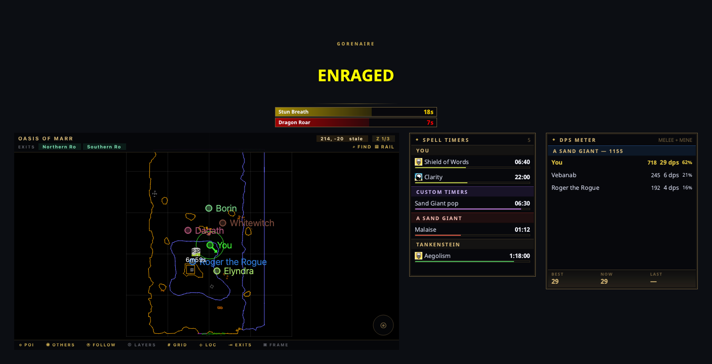

# nParse+ (nparseplus)

[](https://github.com/prokopto-dev/nparse-plus/actions/workflows/ci.yml)
[](https://codecov.io/gh/prokopto-dev/nparse-plus)
[](https://github.com/prokopto-dev/nparse-plus/releases/latest)
[](https://www.python.org/downloads/)
[](https://prokopto-dev.github.io/nparse-plus/latest/getting-started/)
[](LICENSE)



*An Event Overlay alert with raid-AOE countdowns, the live zone map, per-target
spell timers, and the DPS meter.*

**An EverQuest Project 1999 companion overlay for macOS, Windows, and Linux.**

nParse+ tails your EQ log file and gives you, in real time: per-target
spell/buff timers, a full trigger engine with voice alerts, a DPS meter,
live maps with an NPC finder, respawn timers, complete-heal chain tracking,
raid-AOE countdowns, and mob info — everything a Windows user gets from
[EQTool/PigParse](https://github.com/smasherprog/eqtool), running natively
in Python, with live network interop with EQTool users. It began as a fork
of [nParse](https://github.com/nomns/nparse) by nomns and keeps its map
overlay heritage.

It reads the log file only — no memory reading, no injection, no game files
modified (the optional Night Vision fix is applied only when you ask).

There is also an optional add-on system for people who want to extend it:
a published SDK (`nparseplus-sdk`) for third-party windows, parsers, and
alerts. It is **off by default** and nothing above depends on it — you turn
add-ons on in Settings → Advanced or you never see them.

## 📖 Documentation

**Full documentation lives at
[prokopto-dev.github.io/nparse-plus](https://prokopto-dev.github.io/nparse-plus/)** —
versioned per release, including:

- [Getting Started](https://prokopto-dev.github.io/nparse-plus/latest/getting-started/) — install, first run, updating
- [Why nParse+](https://prokopto-dev.github.io/nparse-plus/latest/comparison/) — feature comparison with EQTool, nParse, and GINA
- [Migrating from nParse / GINA / EQTool](https://prokopto-dev.github.io/nparse-plus/latest/migrating/)
- [Windows & Overlays](https://prokopto-dev.github.io/nparse-plus/latest/windows/) and [Features](https://prokopto-dev.github.io/nparse-plus/latest/features/)
- [Settings Reference](https://prokopto-dev.github.io/nparse-plus/latest/settings/) · [FAQ](https://prokopto-dev.github.io/nparse-plus/latest/faq/) · [Troubleshooting](https://prokopto-dev.github.io/nparse-plus/latest/troubleshooting/)
- [Plugins](https://prokopto-dev.github.io/nparse-plus/latest/plugins/) — the optional add-on system and the SDK for writing one

## Quick start

Grab the [latest release](https://github.com/prokopto-dev/nparse-plus/releases/latest):

- **macOS** — open the `.dmg`, drag **nParse+** to Applications, then clear
  the quarantine flag once:
  `xattr -dr com.apple.quarantine "/Applications/nParse+.app"`
  ([full guide](https://prokopto-dev.github.io/nparse-plus/latest/getting-started/install-macos/))
- **Windows** — unzip `nparseplus-<version>-win64.zip` and run
  `nparseplus.exe`
  ([full guide](https://prokopto-dev.github.io/nparse-plus/latest/getting-started/install-windows/))
- **Linux** — `flatpak install --user nparseplus-<version>-linux-x86_64.flatpak`
  (then plain `flatpak update` keeps it current), or use the tarball
  ([Flatpak guide](https://prokopto-dev.github.io/nparse-plus/latest/getting-started/install-flatpak/) ·
  [tarball guide](https://prokopto-dev.github.io/nparse-plus/latest/getting-started/install-linux-tarball/))

Then: turn on `/log on` in game, point nParse+ at your EQ **Logs** folder
from the tray, and you're parsing —
[first-run guide](https://prokopto-dev.github.io/nparse-plus/latest/getting-started/first-run/).

## Development

```bash
uv sync                                   # deps (incl. dev group); resolves
                                          # the workspace, so sdk/ comes too
uv run pytest                             # ~1460 tests (incl. sdk/tests)
uv run ruff check . && uv run ruff format .
QT_QPA_PLATFORM=offscreen uv run pytest   # headless (CI does this)
```

The repo is a [uv workspace](https://docs.astral.sh/uv/concepts/projects/workspaces/):
the app in `src/nparseplus/`, and the plugin contract package
`nparseplus-sdk` in `sdk/`, versioned and released separately — see
[CONTRIBUTING.md](CONTRIBUTING.md#working-on-the-sdk).

See [CLAUDE.md](CLAUDE.md) for the architecture guide — the one rule that
matters most: **`nparseplus.core` (and `config`/`net`) never import Qt**; a
test enforces it. Parsers/handlers are 1:1 ports of EQTool's C# (pinned
commit in [CREDITS.md](CREDITS.md)) and the `EQtoolsTests` corpus is our
golden spec. Building, packaging, and the release pipeline are documented in
the site's
[Development section](https://prokopto-dev.github.io/nparse-plus/latest/development/).

## License & credits

GPL-3.0 (inherited from nParse). Feature design, trigger library,
zone/respawn databases, and test corpus ported from
[EQTool](https://github.com/smasherprog/eqtool) (MIT) — see
[CREDITS.md](CREDITS.md) for details and the pinned source commit. Maps are
the community Brewall/P99 set. Not affiliated with Daybreak Games or
Project 1999.
