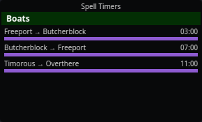

# Boats

P99's boats run on fixed schedules, but knowing *where in the cycle* a boat
is requires seeing it. nParse+ tracks boat sightings and projects the
schedule forward.

## How it works

When a boat's arrival announcement appears in your log (or arrives over the
[PigParse network](sharing.md) from another player who saw it), nParse+
anchors that boat's schedule: it knows the time from announcement to dock
and the full round-trip time for each boat, so one sighting yields the next
docking and departure times.

- Sightings you make are shared to the network, and everyone else's
  sightings flow to you — so on a populated server the boat schedule is
  usually "just known" without anyone standing on the dock.
- Boat timers appear as timer rows in the **Boats** section of
  [Spell Timers](../windows/spell-timers.md), so you can see how long
  until the *Sirensbane* or the *Maiden's Voyage* comes back before you
  decide to swim. Landlubbers can hide the section with "Show boat
  timers" in [Settings → Spell Timers](../settings/spell-timers.md).

This is a port of EQTool's boat service over the same shared feed, so
nParse+ and EQTool users pool their sightings.
