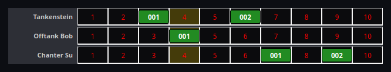

# CH chains

On P99 raids, clerics coordinate Complete Heal casts by calling their slot
in a chain: `CA 001 CH -- Targetname`. nParse+ parses those calls and turns
them into a visual chain monitor — the same protocol EQTool uses, so mixed
raids stay in sync.



## What a call looks like

```
GG 014 CH -- Wreckognize
AAA CH -- Bigtank
RAMP1 CH -- Ramptank
```

An optional raid tag (`GG`, `CA`, …), a chain position (three digits, a
repeated letter, or `RAMP1`-style), the word `CH` (or `RCH` for a re-CH),
and the heal target.

## What you see

Each heal target gets a **lane** on the
[Event Overlay](../windows/event-overlay.md). Every CH call becomes a green
chip labeled with the caster's position, sliding across the lane over the
CH cast time (~11 s) — so the lane literally shows the chain flowing.

The lane is graduated into **10 one-second cells** (numbered 1–10 in red),
matching EQTool: a chip is exactly one cell wide, each cell is one second of
travel, and the full 10-cell bar spans roughly one 10 s Complete Heal cast —
so healers can read their slot's timing straight off the second graduations.
Idle lanes linger for a configurable retention period (default 20 s;
[Settings → Audio & Overlays](../settings/audio-overlays.md)) so healers
keep a stable anchor per target, then disappear. A lane always tears down
once it has been idle past both the retention window and a chip's flight
time — even if a chip animation is interrupted mid-slide, a periodic sweep
guarantees the lane is removed rather than left stuck on the overlay.

A chain entry goes stale after 20 s without a call for its target, matching
EQTool's chain bookkeeping.

## Filter to your raid's tag

Big raids often run more than one CH chain at once, each with its own tag
(`GG`, `CA`, …). Set **CH chain tag** in
[Settings → Audio & Overlays](../settings/audio-overlays.md) to follow only
the calls prefixed with that tag — every other chain's calls are ignored.
Leave it blank (the default) to follow every call regardless of tag. The
setting applies immediately, without a restart.

## Your-slot warning

If you're in the chain, nParse+ tracks the cadence and warns you — on
screen and spoken — when your slot is coming up, so you start your cast on
time even when the raid channel is scrolling.
