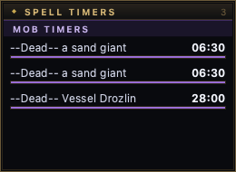

# Respawn & zone timers

When you kill a mob, nParse+ starts a respawn countdown automatically —
using per-NPC respawn times where they're known (a database covering 121
zones, ported from EQTool), or the zone's default respawn time otherwise.

## Where timers show up

- As purple rows in the **Mob Timers** section of
  [Timers](../windows/timers.md), named `--Dead-- <mob>`.
- On the [map](../windows/maps.md), when the kill matches a spawn point —
  the countdown draws at the spawn location.

## Behavior

- **Timers survive camping.** Respawn timers are saved per character and
  restored (elapsed time subtracted) when you log back in — a 6-hour named
  camp doesn't reset because you took a break. Unlike your own buffs and
  cooldowns, respawn rows are **not** hidden while you are camped: a mob's
  spawn clock is the world's, not your character's, so it stays on screen and
  keeps counting. See [Camping and logging back
  in](../windows/timers.md#camping-and-logging-back-in).
- **Duplicate kills get numbered.** Killing two of the same mob while both
  timers run gives the second a `_1` suffix (`--Dead-- a bat`, then
  `--Dead-- a bat_1`); further kills take the smallest free number. Once a
  timer expires its name frees up and is reused, so the list stays tidy
  instead of climbing forever.
- **Expiry announcements** — optionally get an on-screen and spoken
  announcement when a respawn timer hits zero ("Announce respawn-timer
  expiry" in [Settings → Timers](../settings/timers.md)).
- **Shared timers** — with [sharing](sharing.md) on and "Share timers"
  enabled for your character, kill timers flow to your groupmates on the
  PigParse network (and theirs to you), so the whole group sees the same
  camp clock. The Kael **Avatar of War lockout** and **dragon roar**
  timers are shared network-wide the same way.
- `/consider` a mob to see its respawn time in
  [Mob Info](../windows/mob-info.md) before you commit to the camp.
- **Don't want them on screen?** Hide the whole **Mob Timers** section with
  "Show mob timers" in
  [Settings → Timers](../settings/timers.md) (timers keep
  running, expiry announcements still fire) — or right-click a wrong
  timer in the overlay to clear it by hand.

## Manual spawn points

Right-click the map to place a spawn-point marker anywhere and start its
timer by hand — useful for camps the database doesn't know or PH cycles you
want to track visually. Markers persist across restarts. See
[Maps](../windows/maps.md#spawn-points-waypoints-and-corpses).

## Pop windows

Big raid targets don't respawn on a fixed clock. After time-of-death a base
time elapses, and only *then* does the mob become poppable — at any moment
until a latest-possible time. Trakanon is TOD + 4.5 days, then a 12-hour
window.

A timer row can carry that shape. It counts down to the window **opening**
in the ordinary timer colour, then flips **in place** — same row, same
position in the list — to an orange countdown prefixed `POP`, running to the
latest possible spawn. It leaves the window when the window closes, not when
the base time runs out.

- **The bar means the phase you're in.** Before the window it fills over the
  base respawn; inside it, over the window itself. So a row that is 30
  minutes into a 12-hour window reads as nearly full rather than parked on
  empty.
- **Sorting follows the window.** A row inside its window sorts on the time
  left in the window, so it takes its honest place in the list instead of
  pinning to the top for twelve hours.
- **Camping keeps them, in either phase.** A window that opened while you
  were away comes back open, without re-announcing itself; a window that
  closed while you were away is dropped, like any expired timer.
- **Expiry announcements say both ends.** With "Announce respawn-timer
  expiry" on, a `--Dead--` row speaks when its window **opens** ("<mob>
  spawn window open") as well as when it closes. Same setting, no new
  option.

### When a mob has more than one possible window

Some spawns have **several** candidate windows and nobody knows which one
they will use — Lodizal has three. Each candidate gets its own row, sharing
the mob's name and labelled `(1 of 3)`, `(2 of 3)`, `(3 of 3)`.

They behave the way the uncertainty does: every candidate counts down to its
own opening, opens, and lapses if the mob does not appear, leaving only the
chances still to come. So the list always answers "is a window open right
now, and how many chances are left?" without any arithmetic.

- **Announcements name the chance.** "Lodizal spawn window 2 of 3 open" — a
  bare announcement could not say which one came up, nor how many remain.
- **Clear the whole set in one action.** When the mob finally pops, its other
  candidate windows are answered too: right-click any of its rows and choose
  *Clear all 3 windows*, rather than clearing them one at a time.
- **The label keeps its original denominator.** After the first chance
  lapses the second still reads "2 of 3", not "1 of 2" — you are being told
  which candidate this was, not how many are left.

!!! note "Where the numbers come from"

    nParse+ ships the mechanism but **no per-mob window data**, and there is
    no way to type a time of death in yet — both are planned. Until then a
    plugin supplies the figures through
    [`ctx.add_window_timer()`](../plugins/api.md) — or
    `ctx.add_window_series()` for a mob with several candidate windows (SDK
    1.3). See `examples/plugins/tod_window.py` in the repository for a
    working one covering both shapes.
