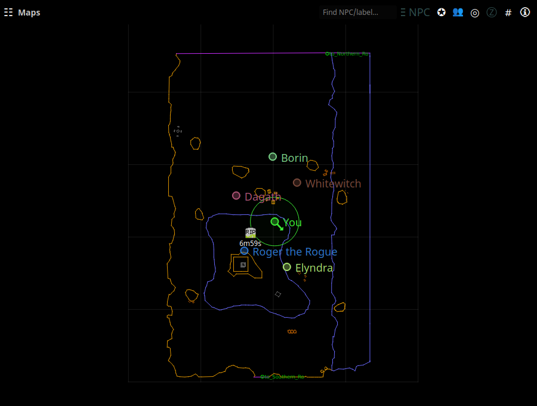

# Sharing & PigParse

Sharing is what turns nParse+ from a personal parser into a group tool:
player dots on the [map](../windows/maps.md), shared kill and raid timers,
and server-wide feeds — interoperating live with
[EQTool](https://github.com/smasherprog/eqtool) users, who speak the same
protocol.

## The two networks

Pick a mode in [Settings → Sharing](../settings/sharing.md):

| Mode | What it is |
|---|---|
| **pigparse** | The public [pigparse.org](https://www.pigparse.org) hub that EQTool uses. Map dots, shared timers, quake/boat/roll feeds, the shared `/who` roster, and loot pricing all flow here. This is where the players are. |
| **nparse** | The original nParse websocket protocol, pointed at any server you choose — including your own (a reference `locationserver` ships in the repo). Location dots and corpse waypoints for a private group, no third-party server involved. |
| **off** | Nothing leaves your machine. |

On top of the global mode, **each character** has a location-sharing
setting — everyone / guild-only / off — and a "Share timers" toggle, in
[Settings → Character](../settings/character.md). Guild-only means only
guildmates see your dot.

## What's shared on PigParse

- **Your location** — sent when you type `/loc` (with a keepalive every
  10 s), stopped after 5 idle minutes or when you camp. You see a zone's
  players once you've sent a location from that zone.
- **Kill/respawn timers** — with Share timers on, your kills start
  [respawn countdowns](respawn-timers.md) for groupmates and vice versa;
  Kael AoW lockout and dragon-roar timers are shared server-wide.
- **Feeds** — earthquake alerts, [boat sightings](boats.md), and
  random-roll results pool across everyone connected.
- **`/who` roster** — player names, classes, and levels from `/who`
  output are pooled, which is how buff timers and the DPS meter can label
  players with classes/levels you never personally saw.
- **Mob loot prices** — [Mob Info](../windows/mob-info.md) gets drop
  lists with pigparse.org's 6-month average auction prices.

The tray shows the current sharing status at the top of the menu.

## pigparse.org account (optional)

Logging in with Discord ([Settings → Sharing](../settings/sharing.md) →
**Log in with Discord**) links your parser to your
[pigparse.org](https://www.pigparse.org) account:

- **Inventory upload** — with the toggle on, typing
  `/outputfile inventory` in game uploads the dump to your pigparse.org
  character browser page, so your gear is inspectable there.

The login token is stored locally in your settings and only ever sent to
pigparse.org. Everything else on this page works without an account.

## Privacy notes

- Nothing is shared unless a sharing mode is on — and even then, only
  what's listed above: locations you `/loc`, timers, feeds, `/who` lines.
  Chat is never shared.
- Per-character **off** and **guild-only** switches mean your bard can be
  loud while your ranger camps quietly.
- The `nparse` mode with your own server keeps everything on
  infrastructure you control.
