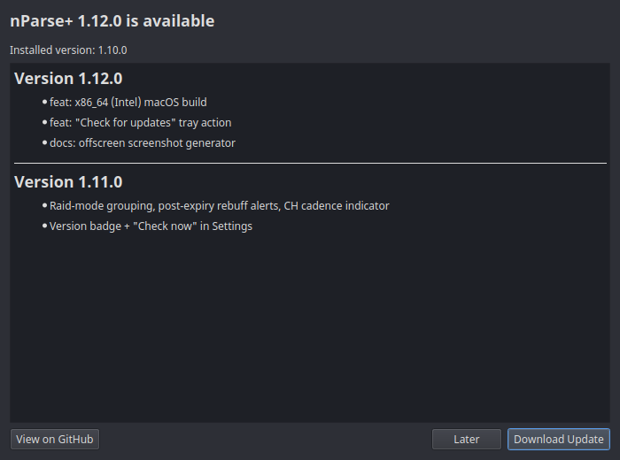

# Self-updater

nParse+ checks the project's
[GitHub releases](https://github.com/prokopto-dev/nparse-plus/releases) at
startup (disable in [Settings → General](../settings/general.md)). Drafts
and prereleases are ignored; versions are compared properly (1.10 > 1.9).

You can also check on demand: **Check for updates** in the tray menu, or
**Check now** in [Settings → General](../settings/general.md). Either reports
back even when you're already on the latest version.

When an update exists:

- the tray menu gains an **Install update vX.Y.Z** entry, and
- clicking it shows a dialog with the **release notes for every version
  between yours and the newest**, then downloads the right asset for your
  platform:

| Platform | Asset picked |
|---|---|
| macOS | the `.dmg` matching your Mac's architecture (`arm64` / `x86_64`) |
| Windows | `.zip` |
| Linux (tarball install) | `.tar.gz` |
| Linux (running inside the Flatpak sandbox) | `.flatpak`, handed to your software installer |

If the expected asset isn't on the release, the release page opens in your
browser instead.

Settings always survive updates — see
[Updating](../getting-started/updating.md) for the per-platform install
steps, and note that Flatpak installs are better served by plain
[`flatpak update`](../getting-started/install-flatpak.md#5-updating).
