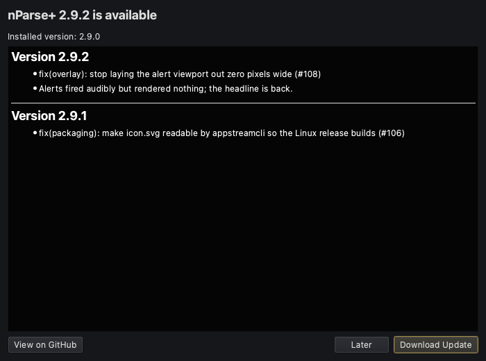

# Self-updater

nParse+ checks the project's
[GitHub releases](https://github.com/prokopto-dev/nparse-plus/releases) at
startup (disable in [Settings → General](../settings/general.md)). Drafts
and prereleases are ignored; versions are compared properly (1.10 > 1.9).

You can also check on demand: **Check for updates** in the tray menu, or
**Check now** in [Settings → General](../settings/general.md). Either reports
back even when you're already on the latest version.

When an update exists:

- the tray menu gains an **Install update vX.Y.Z** entry, and
- clicking it shows a dialog with the **release notes for every version
  between yours and the newest**, then downloads the right asset for your
  platform:

| Platform | Asset picked |
|---|---|
| macOS | the `.dmg` matching your Mac's architecture (`arm64` / `x86_64`) |
| Windows | `.zip` |
| Linux (tarball install) | `.tar.gz` |
| Linux (running inside the Flatpak sandbox) | `.flatpak`, handed to your software installer |

If the expected asset isn't on the release, the release page opens in your
browser instead.

Releases also carry a `-macos-<arch>.zip` of the same `.app` beside each DMG.
It exists for the app's own use — a zip is what code can unpack without
mounting a disk image — and the DMG stays the download for a person.

## Verified downloads

Every download is checked against the sha256 checksum GitHub publishes for
that asset before anything opens it, and a download that doesn't match is
deleted rather than handed to you. Three outcomes are reported differently,
because they mean different things:

| What you see | What happened |
|---|---|
| **Update download refused** | The bytes that arrived are not the ones the release describes. Almost always a corrupted or interrupted transfer — try again. Nothing was installed, and the release page is *not* opened for you: it serves the same artifact that was just refused. |
| **Update download failed** | The transfer never completed (timeout, server error, dropped connection). A network problem; the release page opens so you can fetch it by hand. |
| **Update downloaded, but not verified** | The download completed, but that release publishes no checksum to check it against. Only releases from before GitHub served per-asset checksums are affected. |

The refusal dialog's **Show Details** carries both checksums — the one
published and the one that arrived — which is the useful thing to paste into
a bug report.

Note what this check is: the checksum travels over the same connection as the
release information that describes it, so it proves the file you got is the
file GitHub named. It is not a signature, and it does not defend against
anything able to publish a release in the first place.

Settings always survive updates — see
[Updating](../getting-started/updating.md) for the per-platform install
steps, and note that Flatpak installs are better served by plain
[`flatpak update`](../getting-started/install-flatpak.md#5-updating).
