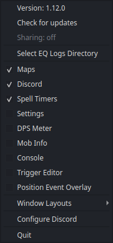

# First run

nParse+ lives in your system tray — the tray icon toggles every window and
holds Settings. On first launch, two things need to be true: the game is
writing a log, and nParse+ is watching the right folder.



## 1. Turn on logging in game

In EverQuest, type:

```
/log on
```

The game starts writing `eqlog_<Character>_<server>.txt` into the `Logs`
folder of your EQ install. Logging stays on between sessions.

## 2. Pick your EQ Logs directory

If nParse+ doesn't auto-detect it (default: `~/Games/EverQuest/Logs`), pick
it via tray → **Select EQ Logs Directory**, or in
[Settings → General](../settings/general.md).

Where that folder is depends on how you run EQ:

=== "macOS (WINE / CrossOver / Whisky)"

    The `Logs` folder is inside the wrapper's virtual drive, e.g.
    `~/Library/Application Support/CrossOver/Bottles/<bottle>/drive_c/...`
    or wherever your wrapper keeps its `drive_c`. Find your EverQuest
    install inside it; `Logs` sits at the install root.

=== "Windows"

    `Logs` is directly inside your EverQuest install folder, e.g.
    `C:\P99\EverQuest\Logs`.

=== "Linux (WINE / Lutris / Bottles)"

    Inside the WINE prefix, e.g.
    `~/Games/everquest/drive_c/EverQuest/Logs` (Lutris) or
    `~/.var/app/com.usebottles.bottles/...` (Bottles Flatpak). On a
    Flatpak install of nParse+, EQ installs outside your home directory
    need a one-time permission grant — see
    [the Flatpak guide](install-flatpak.md#4-eq-installs-outside-your-home-directory).

nParse+ always follows the **newest** log file in the folder, so switching
characters just works — camp, log in the other character, and the overlays
follow.

## 3. Check it's alive

Open the [Console window](../windows/console.md) from the tray and say
something in game — the line should appear immediately. If it does,
everything downstream (timers, triggers, maps) is live.

## 4. Make it yours

- **Character profile**: nParse+ creates a per-character profile when it
  first sees a log. Set your class and level in
  [Settings → Character](../settings/character.md) so spell durations are
  calculated correctly.
- **EQ install directory** (optional, [Settings →
  General](../settings/general.md)): lets nParse+ read your real
  `spells_us.txt` (instead of the bundled copy) and enables the
  [Night Vision fix](../features/night-vision.md) and
  [Friends sync](../features/friends-sync.md).
- **Windows**: toggle overlays from the tray; drag them into place (they're
  frameless — hover to reveal the title bar). See
  [Windows & Overlays](../windows/index.md) for tips, including the
  Event Overlay positioning flow.
- **Sharing**: to see other players' dots on the map, enable location
  sharing — see [Sharing & PigParse](../features/sharing.md).

## Where settings live

Everything persists to `settings.json` in your platform config directory:

| Platform | Path |
|---|---|
| macOS | `~/Library/Application Support/nparseplus/` |
| Windows | `%LOCALAPPDATA%\nparseplus\` |
| Linux | `~/.config/nparseplus/` (Flatpak: `~/.var/app/io.github.prokopto_dev.nparse_plus/config/nparseplus/`) |

An old nParse `nparse.config.json` is
[migrated automatically](../migrating/from-nparse.md) on first run.
