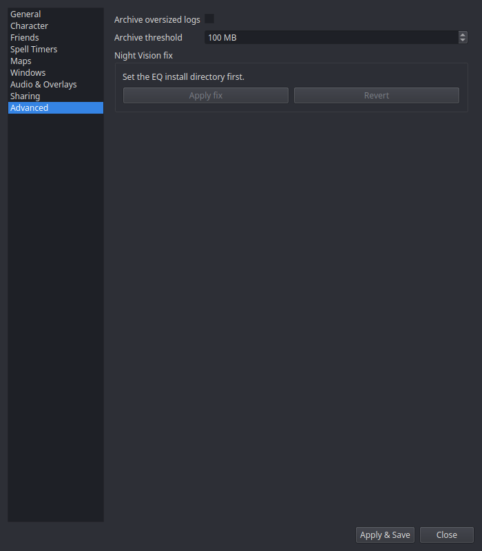

# Settings → Advanced

## Log archiving

| Setting | What it does |
|---|---|
| **Archive oversized logs** | EQ log files grow forever (the game only appends). With this on, nParse+ moves oversized logs into an archive folder and lets the game start a fresh one. |
| **Archive threshold** | The size (MB) at which a log gets archived. |

## Night Vision fix

Apply/revert buttons for the
[Night Vision fix](../features/night-vision.md) — the community shader/sky
fix extracted over your EQ install with automatic backups. Requires the
**EQ install directory** ([General](general.md)); quit EQ before applying.
The status line shows whether the fix is currently applied.
