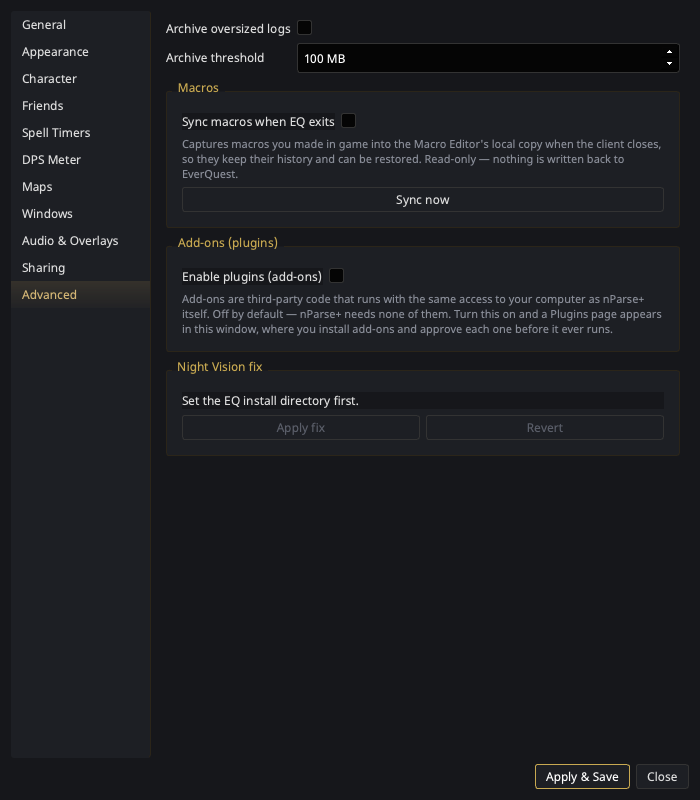

# Settings → Advanced

## Log archiving

| Setting | What it does |
|---|---|
| **Archive oversized logs** | EQ log files grow forever (the game only appends). With this on, nParse+ moves oversized logs into an archive folder and lets the game start a fresh one. |
| **Archive threshold** | The size (MB) at which a log gets archived. |

## Macros

| Setting | What it does |
|---|---|
| **Sync macros when EQ exits** | Off by default. When the EQ client closes, nParse+ re-reads your character ini files and folds any macros you made or changed in game into the [Macro Editor](../windows/macro-editor.md)'s local copy. |
| **Sync now** | Runs that same scan immediately, without waiting for the client to exit. |

The status line below the toggle reports the last sync — when it ran and
how many macros were new, changed, or missing from the game files.

!!! note "Read-only"
    Sync only ever *reads* your EQ directory and writes nParse+'s own copy.
    It never writes macros back into the game, so it can't overwrite
    anything you did in game. Putting a lost macro back is still a
    deliberate **Restore from local copy** click in the Macro Editor.

Requires the **EQ install directory** ([General](general.md)). Syncing
happens on the client-exit edge rather than on a timer, so it never reads
the files while the game has them open.

## Night Vision fix

Apply/revert buttons for the
[Night Vision fix](../features/night-vision.md) — the community shader/sky
fix extracted over your EQ install with automatic backups. Requires the
**EQ install directory** ([General](general.md)); quit EQ before applying.
The status line shows whether the fix is currently applied.
