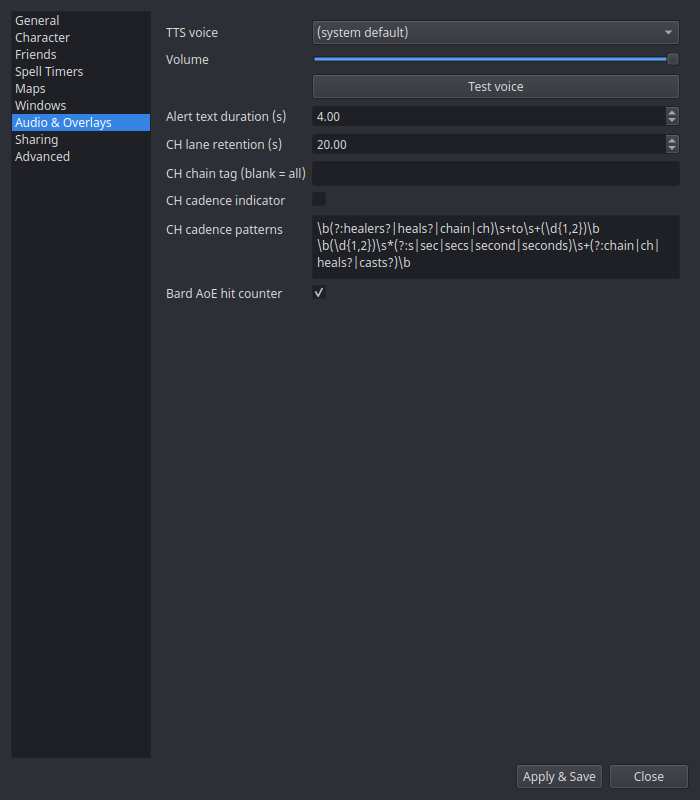

# Settings → Audio & Overlays

Voice and overlay timing, serving [TTS](../features/tts.md) and the
[Event Overlay](../windows/event-overlay.md).

| Setting | What it does |
|---|---|
| **TTS voice** | Pick from your system's installed voices (or the system default). Applies after restart. |
| **Volume** | Speech volume. |
| **Test voice** | Speaks a sample line with the current voice/volume. |
| **Alert text duration (s)** | How long trigger alert text stays on the Event Overlay (default 4 s). |
| **CH lane retention (s)** | How long an idle [CH chain lane](../features/ch-chains.md) lingers after its last call (default 20 s). |
| **CH chain tag (blank = all)** | Follow only [CH chain](../features/ch-chains.md) calls prefixed with this raid tag (e.g. `GG`). Blank follows all calls. Applies immediately. |
| **CH cadence indicator** | Opt-in. When the raid leader calls a cadence in chat ("healers to 4 seconds", "chain to 3", "CH to 5", "4 second chain"), draw a muted marker on that second-cell of the [CH lane](../features/ch-chains.md) as the next-expected-cast tick. Off by default. |
| **Bard AoE hit counter** | Show a yellow overlay and speak a tally of bard AoE hits/resists when a swarm session finalizes. Only fires for 2+ hits, so a stray wince stays quiet. On by default. |
