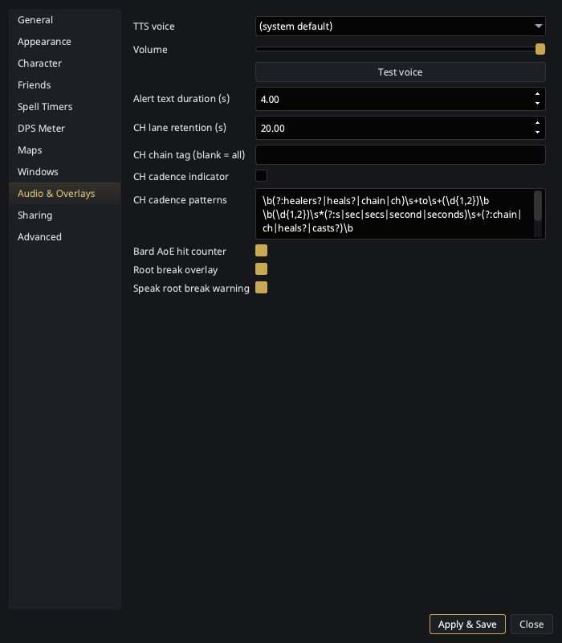

# Settings → Audio & Overlays

Voice and overlay timing, serving [TTS](../features/tts.md) and the
[Event Overlay](../windows/event-overlay.md).

| Setting | What it does |
|---|---|
| **TTS voice** | Pick from your system's installed voices (or the system default). |
| **Volume** | Speech volume. |
| **Test voice** | Speaks a sample line with the current voice/volume. |
| **Alert text duration (s)** | How long trigger alert text stays on the Event Overlay (default 4 s). Also paces the scroll an over-long alert uses, so raising it both keeps the alert up longer and slows the scroll to match. |
| **CH lane retention (s)** | How long an idle [CH chain lane](../features/ch-chains.md) lingers after its last call (default 20 s). |
| **CH chain tag (blank = all)** | Follow only [CH chain](../features/ch-chains.md) calls prefixed with this raid tag (e.g. `GG`). Blank follows all calls. Applies immediately. |
| **CH cadence indicator** | Opt-in. When the raid leader calls a cadence in chat ("healers to 4 seconds", "chain to 3", "CH to 5", "4 second chain"), draw a muted marker on that second-cell of the [CH lane](../features/ch-chains.md) as the next-expected-cast tick. Off by default. |
| **CH cadence patterns** | The regexes that recognize a cadence callout — one per line, each with a capturing group `( )` for the seconds (like a trigger's search text). Blank uses the stock phrasings. |
| **Bard AoE hit counter** | Show a yellow overlay and speak a tally of bard AoE hits/resists when a swarm session finalizes. Only fires for 2+ hits, so a stray wince stays quiet. On by default. |
| **Root break overlay** | Show a red `<Spell> has worn off!` alert when one of your roots wears off — the CC'd add is loose, or the parked mob isn't parked. Covers Root, Fetter, Enstill, Immobilize, Paralyzing Earth and the Roots line (Grasping / Ensnaring / Enveloping / Engulfing / Engorging / Entrapping). On by default. |
| **Speak root break warning** | Speak the same warning. Independent of the overlay toggle — take one, both, or neither. On by default. |

Everything on this page applies as soon as you hit Apply — no restart. A
voice or volume change reaches the trigger engine and the alert handlers that
are already running; the durations take effect on the next alert and the next
lane; and the alert toggles are read at the moment something would fire, so
un-ticking one silences it immediately.

## Test alerts

You find out whether the overlay is where you want it, whether the voice is
audible over the game, and whether the alert you configured actually fires —
at the moment it needs to already work. **Test alerts** lets you rehearse it
instead.

Each button pushes a sample log line through the **real** parser, so what you
see and hear is what a live event produces, not a preview of it: the parser
chain runs, the handler speaks and raises the alert, and the Event Overlay
draws it. Nothing is faked, and nothing new is read from your log.

| Button | What it rehearses |
|---|---|
| **First to engage** | The yellow FTE banner and its callout, from `a training dummy engages Testcharacter!` |
| **Engage rule timer** | The same banner for a mob that carries a raid engage rule (`Zlandicar`), plus the `--97% Rule--` countdown it starts in the [Timers](../windows/timers.md) window |
| **Root break** | The red root-break alert, honouring the two root-break toggles above |
| **/random rolls** | Three sample rolls, as the Timers window draws a roll group. The maximum they are rolled out of is picked against the live rows, so the samples always get a group of their own and never land in a real loot roll |

Your **saved** settings decide what fires. That is deliberate — an alert that
only speaks in test mode has told you nothing — so if you have just changed a
toggle, hit Apply first. (EQTool's equivalent forces the alert's toggles on
before testing; nParse+ does not.)

A rehearsal lasts as long as the rehearsal. The two samples that leave a row
in the Timers window take it back when you fire another one or when you close
this window, and neither is ever saved to disk. The other two leave nothing
at all.

A rehearsal also never *removes* or changes a row it did not create. Firing
the real path means real handlers run, and one of them answers a root wearing
off by dropping the matching timer — so anything that goes missing while a
sample runs is put straight back, exactly as it was.

!!! note "Why there is no death-loop test"

    EQTool offers one; nParse+ deliberately does not. It fires on four of
    your own deaths, and your own death is one of the most consequential
    lines the log has: nParse+ persists a corpse marker to the map and
    broadcasts a waypoint to everyone sharing with you, drops the pet it was
    tracking, and freezes every fight targeting you into your session stats.
    None of that is undoable, and a rehearsal may not cost you any of it. The
    alert itself — a red overlay plus speech — is exactly what **Root break**
    puts on screen.
