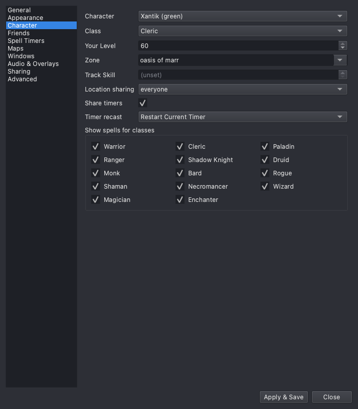

# Settings → Character

nParse+ keeps a **profile per character** (created automatically the first
time it sees a character's log). The Character page edits the profile
selected in the top dropdown — switch characters in game and the active
profile follows.

| Setting | What it does |
|---|---|
| **Character** | Which profile you're editing. |
| **Class** / **Your Level** | Drive spell-duration math for [Timers](../windows/timers.md) — a level 60 enchanter's Clarity lasts longer than a level 20's. Auto-filled from your own `/who` row (and from level-up / class-detect log lines); a quick `/who` in game refreshes them, even while this window is open. |

!!! note "Clicky items are timed from your level"

    On Project 1999 an item's effect is cast **as if you cast the spell
    yourself, at your own level** — so a level 60 character clicking a
    low-level item gets the full level-60 duration, and the spell's own cap is
    what limits it. The `at Level N` shown on a P99 wiki item page is the level
    at which you may *begin* clicking the item, not the level it casts at.

    nParse+ v2.28.2 briefly had this backwards and timed clickies from the
    item's level, which under-reported them; it is fixed.

| **Zone** | The character's current zone — auto-detected from zone-change lines and from a plain `/who` (a global `/who all` carries no zone, so it can't update this). |
| **Track Skill** | Your tracking skill; draws the tracking-radius circle on the [map](../windows/maps.md) for Druids/Rangers/Bards. |
| **Location sharing** | Per-character: everyone / guild-only / off. Guild-only shows your dot only to guildmates ([Sharing](../features/sharing.md)). |
| **Share timers** | Whether this character's kill timers are shared to (and received from) the network. |
| **Timer recast** | What happens when a tracked detrimental is recast mid-timer: **Restart Current Timer** or **Start New Timer** (stacked rows). Roots always refresh. |
| **Show spells for classes** | Per-class filter checkboxes — hide spell timer rows for classes you don't care about (e.g. hide warrior discs on your cleric). |
