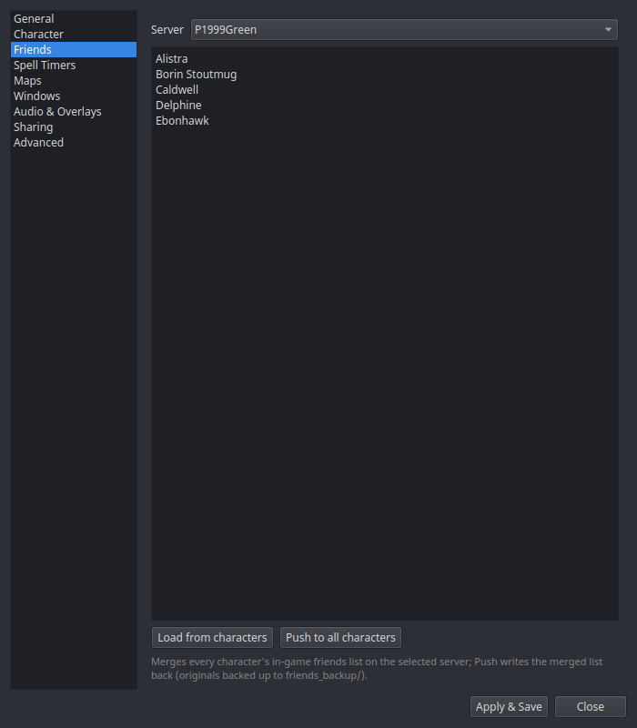

# Settings → Friends

The UI for [Friends sync](../features/friends-sync.md) — merging every
character's in-game friends list on a server and pushing the merged list
back.

| Control | What it does |
|---|---|
| **Server** | Which server's character ini files to work with: P1999Green, P1999Blue, P1999Red, Real-Test. |
| **Load from characters** | Reads the `[Friends]` section from every `<Name>_<Server>.ini` in your EQ install and merges them into the text box (one name per line — edit freely). |
| **Push to all characters** | Writes the merged list back to every character's ini. Originals are backed up to `friends_backup/` before the first write. |

Requires the **EQ install directory** to be set in
[General](general.md). Push while characters are logged out — the game
reads the files at login.
