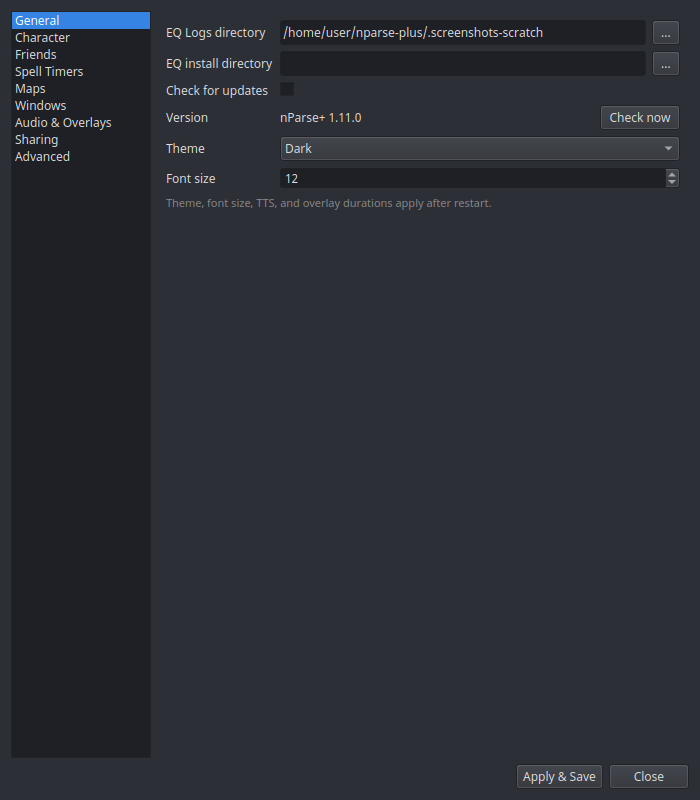

# Settings → General

| Setting | What it does |
|---|---|
| **EQ Logs directory** | The folder nParse+ watches for `eqlog_*.txt` files. The single most important setting — see [First run](../getting-started/first-run.md) for where to find it per platform. |
| **EQ install directory** | Optional. Points at the EverQuest install itself; enables reading your real `spells_us.txt` (instead of the bundled copy), [Friends sync](../features/friends-sync.md), the [Night Vision fix](../features/night-vision.md), and the [inventory watcher](../features/sharing.md#pigparseorg-account-optional). |
| **Check for updates** | The startup GitHub release check ([Self-updater](../features/updater.md)). |
| **Theme** | Dark or Light — applies to every window after restart. |
| **Font size** | Base font size for the overlays, after restart. |
