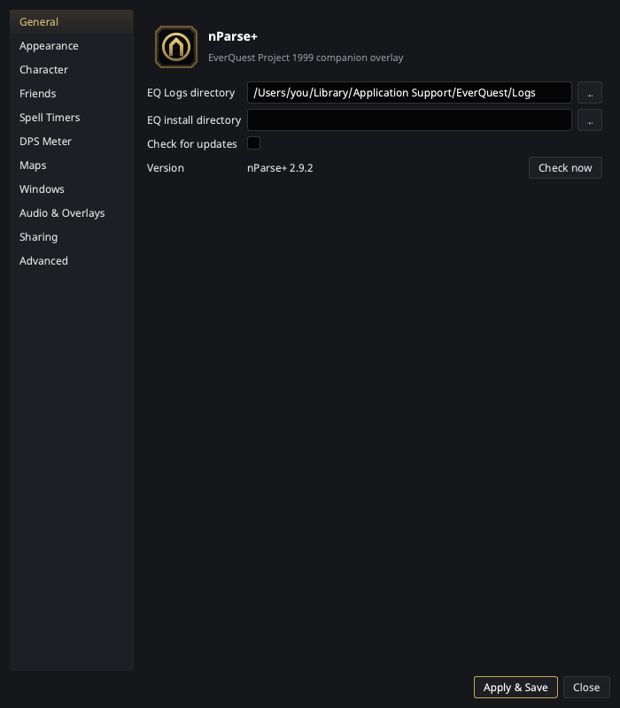

# Settings → General

| Setting | What it does |
|---|---|
| **EQ Logs directory** | The folder nParse+ watches for `eqlog_*.txt` files. The single most important setting — see [First run](../getting-started/first-run.md) for where to find it per platform. |
| **EQ install directory** | Optional. Points at the EverQuest install itself; enables reading your real `spells_us.txt` (instead of the bundled copy), [Friends sync](../features/friends-sync.md), the [Macro Editor](../windows/macro-editor.md), the [Night Vision fix](../features/night-vision.md), and the [inventory watcher](../features/sharing.md#pigparseorg-account-optional). Applies on **Apply** — the spell database switches over for the next spell you cast, with no restart. |
| **Check for updates** | The startup GitHub release check ([Self-updater](../features/updater.md)). |
| **Update channel** | Which releases you are offered: **Stable** (default — released versions only) or **Beta** (also the test releases cut from each merge to master). Switching re-checks immediately. A beta client is still offered stable releases, so a promoted version rolls you back onto the stable line. Betas are **not published for Flatpak**, so inside a Flatpak the Beta option is disabled and the channel is clamped to Stable — see [Release channels](../getting-started/updating.md#release-channels). |
| **Version indicator** | Shows the running **nParse+ &lt;version&gt;** with a status badge — green **Up to date** or amber **Update available: vX.Y.Z** — and a **Check now** button to re-run the release check on demand. (Previously the version was only visible in the tray menu.) |
