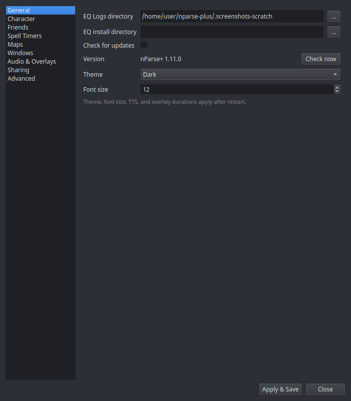

# Settings Reference

Open **nParse+ Settings** from the tray. Settings are organized into
sidebar pages, documented one-per-page here, mirroring the app:

| Page | Covers |
|---|---|
| [General](general.md) | Log/install directories, updates, theme, font size |
| [Character](character.md) | Per-character profiles: class, level, sharing, spell filters |
| [Friends](friends.md) | Friends-list merge and push |
| [Spell Timers](spell-timers.md) | Timer behavior toggles and buff-fade warnings |
| [Maps](maps.md) | Line widths, label size, other players, z-fade |
| [Windows](windows.md) | Per-window on-top / opacity / click-through |
| [Audio & Overlays](audio-overlays.md) | TTS voice/volume, alert durations |
| [Sharing](sharing.md) | Network mode, pigparse.org account, inventory upload |
| [Advanced](advanced.md) | Log archiving, Night Vision fix |

**Apply & Save** writes everything to disk; **Close** discards pending
edits. A few settings note that they apply after restart (theme, font
size, TTS engine, sharing mode).

Settings persist to `settings.json` in your
[platform config directory](../getting-started/first-run.md#where-settings-live).
You never need to edit the file by hand, but it's plain JSON if you want
to back it up or sync it between machines.
