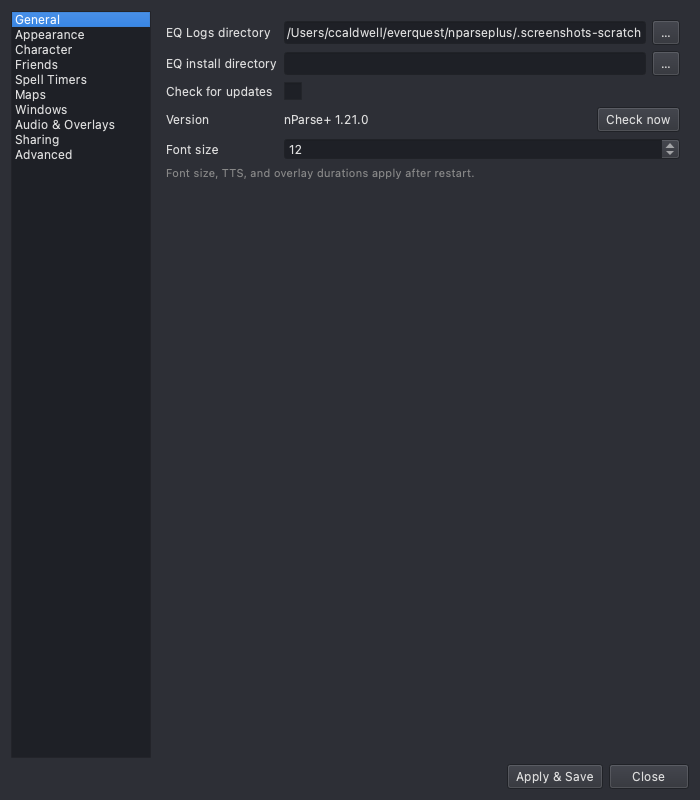

# Settings Reference

Open **nParse+ Settings** from the tray. Settings are organized into
sidebar pages, documented one-per-page here, mirroring the app:

| Page | Covers |
|---|---|
| [General](general.md) | Log/install directories and updates |
| [Appearance](appearance.md) | Overlay skin, UI/overlay font size, and on-game alert styling |
| [Character](character.md) | Per-character profiles: class, level, sharing, spell filters |
| [Friends](friends.md) | Friends-list merge and push |
| [Timers](timers.md) | Timer behavior toggles and buff-fade warnings |
| [DPS Meter](dps-meter.md) | What the meter counts: damage sources, pets, windows |
| [Maps](maps.md) | Line widths, label size, other players, backdrop, z-fade |
| [Windows](windows.md) | Per-window on-top / opacity / click-through |
| [Audio & Overlays](audio-overlays.md) | TTS voice/volume, alert durations |
| [Sharing](sharing.md) | Network mode, pigparse.org account, character dump upload |
| [Advanced](advanced.md) | Log archiving, macro sync, add-ons switch, Night Vision fix |
| [Plugins](plugins.md) | Optional, off by default — only appears once add-ons are enabled in Advanced |

**Apply & Save** writes everything to disk; **Close** discards pending
edits. Almost everything then applies to the running app — voices, alert
durations, counting rules, the dump destination, the spell database behind
your EQ install directory. The overlay skin previews as soon as you pick it,
and the UI/overlay font size applies to open overlays when you save.

Two things still need a restart, and the page says so where you set them:

- **Turning location sharing on**, or switching between the pigparse and
  nparse networks ([Sharing](sharing.md)). Turning it *off* applies
  immediately.
- **Enabling add-ons**, and any install, uninstall or enable/disable of one
  ([Advanced](advanced.md), [Plugins](plugins.md)).

Settings persist to `settings.json` in your
[platform config directory](../getting-started/first-run.md#where-settings-live).
You never need to edit the file by hand, but it's plain JSON if you want
to back it up or sync it between machines.
