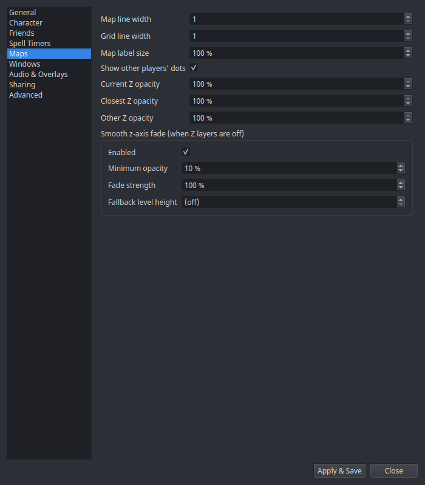

# Settings → Maps

Display tuning for the [Maps window](../windows/maps.md).

| Setting | What it does |
|---|---|
| **Map line width** | Thickness of map geometry lines. |
| **Grid line width** | Thickness of the coordinate grid. |
| **Map label size** | Scales POI labels, player names, and spawn countdowns. |
| **Show other players' dots** | Master toggle for shared player dots ([Sharing](../features/sharing.md)). |
| **Per-Z-layer opacity** | Opacity per elevation layer when explicit Z layers are on. |

## Smooth z-axis fade

When explicit Z layers are **off**, geometry far above or below you fades
out smoothly instead of switching layers — tuned per zone, with these
knobs:

| Setting | What it does |
|---|---|
| **Enabled** | Turn the smooth fade on/off. |
| **Minimum opacity** | The floor — geometry never fades below this, so upper floors stay faintly visible. |
| **Fade strength** | How aggressively opacity falls off with vertical distance. |
| **Fallback level height** | Assumed floor height for zones without tuned level data. |
