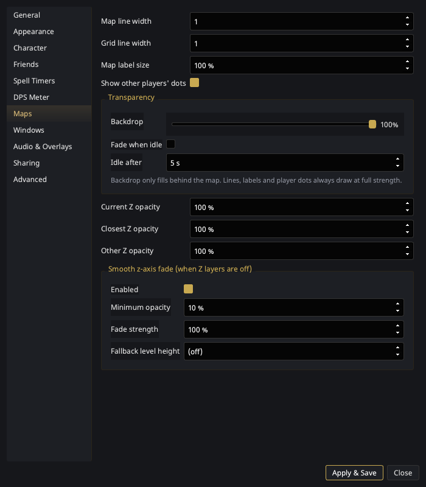

# Settings → Maps

Display tuning for the [Maps window](../windows/maps.md).

| Setting | What it does |
|---|---|
| **Map line width** | Thickness of map geometry lines. |
| **Grid line width** | Thickness of the coordinate grid. |
| **Map label size** | Scales POI labels, player names, and spawn countdowns. |
| **Show other players' dots** | Master toggle for shared player dots ([Sharing](../features/sharing.md)). |
| **Per-Z-layer opacity** | Opacity per elevation layer when explicit Z layers are on. |

## Transparency

Two controls, not one — because one number was doing two jobs.

| Setting | What it does |
|---|---|
| **Backdrop** | Alpha of the fill *behind* the map. 0% is glass — geometry floating on the game. ~60% separates the lines from whatever is behind them. 100% reads like a paper map, for when you have parked and are planning a route. |
| **Fade when idle** | Drop the backdrop to nothing after a few seconds of no input, so a map you are not touching stops inking the game. Touching it brings your value straight back. |
| **Idle after** | How long "not touching it" means. |

Backdrop only fills behind the map — **lines, labels and player dots
always draw at full strength.** That is the difference from the map's
**window opacity** on the [Windows](windows.md) page, which fades the
whole window, geometry included: turning the map see-through with that
one also dims the lines you were trying to read.

!!! tip "Without a settings trip"
    Scroll the wheel near a map edge to nudge the backdrop up or down
    mid-pull. Away from the edges the wheel still zooms as it always did.

## Smooth z-axis fade

When explicit Z layers are **off**, geometry far above or below you fades
out smoothly instead of switching layers — tuned per zone, with these
knobs:

| Setting | What it does |
|---|---|
| **Enabled** | Turn the smooth fade on/off. |
| **Minimum opacity** | The floor — geometry never fades below this, so upper floors stay faintly visible. |
| **Fade strength** | How aggressively opacity falls off with vertical distance. |
| **Fallback level height** | Assumed floor height for zones without tuned level data. |
