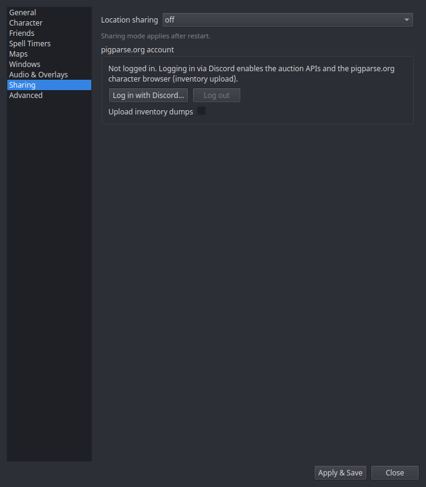

# Settings → Sharing

The network switch, and the optional pigparse.org account. Background:
[Sharing & PigParse](../features/sharing.md).

| Setting | What it does |
|---|---|
| **Location sharing** | The global mode: **pigparse** (the public hub EQTool uses), **nparse** (self-hostable websocket), or **off**. Applies after restart. |

Per-character everyone/guild-only/off switches and the Share timers toggle
live on the [Character](character.md) page — the global mode picks the
network; the character settings decide what that character sends.

## pigparse.org account

| Control | What it does |
|---|---|
| **Log in with Discord…** | Opens your browser for pigparse.org's Discord OAuth login; the status line shows progress. The resulting token is stored locally in your settings. |
| **Log out** | Clears the token. |
| **Upload inventory dumps** | With a logged-in account: typing `/outputfile inventory` in game uploads the dump to your pigparse.org character page. Off by default. |

An account is **not** required for map dots, shared timers, or feeds —
only for inventory upload.
