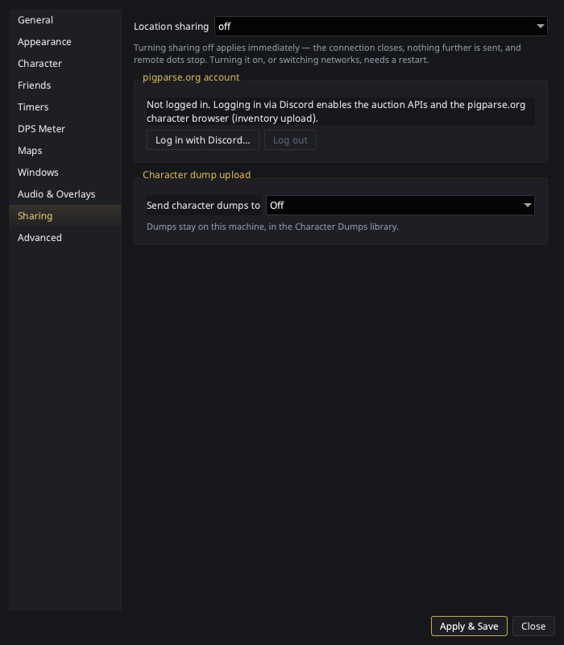

# Settings → Sharing

The network switch, and the optional pigparse.org account. Background:
[Sharing & PigParse](../features/sharing.md).

| Setting | What it does |
|---|---|
| **Location sharing** | The global mode: **pigparse** (the public hub EQTool uses), **nparse** (self-hostable websocket), or **off**. |

Each direction applies differently, and the page says so:

- **Turning it off applies immediately.** Hit Apply and the connection
  closes, and remote dots, waypoints, dragon roars and shared timers stop
  arriving. The tray's sharing line reads `off`. Nothing further is
  published either — the `/who` roster sync and the NPC-activity posts that
  carry your last `/loc` stop with it, the same state as launching with
  sharing off. (Character dump upload is *not* affected: that is its own
  setting, below.)
- **Turning it on — or switching between pigparse and nparse — needs a
  restart.** The network client and the handlers that publish through it are
  built at startup. That includes turning it *back* on after turning it off
  in the same session: nothing resumes, neither the map dots nor the
  publishing, until you restart. The tray's sharing line says so —
  `pigparse — restart to connect`.

Per-character everyone/guild-only/off switches and the Share timers toggle
live on the [Character](character.md) page — the global mode picks the
network; the character settings decide what that character sends.

## pigparse.org account

| Control | What it does |
|---|---|
| **Log in with Discord…** | Opens your browser for pigparse.org's Discord OAuth login; the status line shows progress. The resulting token is stored locally in your settings. |
| **Log out** | Clears the token. |

An account is **not** required for map dots, shared timers, or feeds — only
for uploading to pigparse.org's character browser (below), and not even for
that if you send your inventory to p99planner instead.

## Character dump upload

One picker, **Send character dumps to**, because both destinations publish
the same character to a different website:

| Destination | What it needs | Takes | What happens |
|---|---|---|---|
| **Off** (default) | — | — | Dumps stay on this machine, in the [Character Dumps](../windows/character-dumps.md) library. |
| **pigparse.org character page** | The Discord login above | Inventory | Typing `/outputfile inventory` in game uploads the dump to your pigparse.org character page. |
| **p99planner.com** | Nothing | Inventory and spellbook | The export is staged at p99planner.com and a review page opens in your browser, where you approve the import. No account, no API key, no login. |

Picking **pigparse.org** here does not turn on location sharing, and it never
makes this client publish anything else to pigparse.org: the `/who` roster
sync and the NPC-activity feed belong to **Location sharing** above, and stay
off unless that is set to pigparse. Uploading a dump with the sharing mode on
**nparse** sends the dump and nothing more.

`/outputfile spellbook` only has somewhere to go with **p99planner.com**
picked — pigparse.org's character browser has no spellbook page. With
pigparse picked, a spellbook is still collected into the library; it just
isn't published.

p99planner never applies anything without you approving it on that page, and
later dumps in the same session join the *same* review link for 24 hours — a
character's inventory and spellbook show up there as one entry. The link is
private — treat it like a password; see
[Character Dumps](../windows/character-dumps.md#uploading-your-dumps).

Whichever you pick, uploading is fed by the same scan that fills the
[Character Dumps](../windows/character-dumps.md) library, so that window's
**auto-import** has to be on (it is by default) for a dump to be noticed
automatically.

What uploads on its own is deliberately narrow:

- Only dumps taken **during the current session**. Ones already sitting in
  the EQ folder at launch are collected locally but never published.
- Only from the **EQ directory** — the automatic scan, and **Import now**.
  A file chosen with **Import file…** is filed away and never uploaded: it
  may be a backup, an export off another machine, or another player's dump,
  and none of those were offered up for publishing by being picked in a file
  dialog.
- **Auto-update** does not affect it either way. That setting decides how
  much local history to keep and has no say in what leaves your machine.

For anything outside that — an older dump, a hand-imported one, or a whole
mule roster at once — use **Upload dumps** in the Character Dumps window.

Changing the destination applies after a restart.
