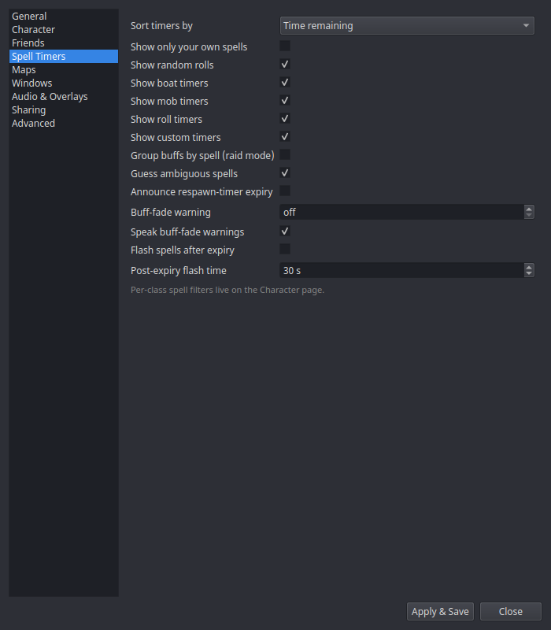

# Settings → Spell Timers

Behavior toggles for the [Spell Timers overlay](../windows/spell-timers.md)
and timer engine. (Per-class spell filters live on the
[Character](character.md) page.)

| Setting | What it does |
|---|---|
| **Sort timers by** | Row order under each header: **Time remaining** (default) puts the soonest-to-expire row at the top, or **Alphabetical** by name. Counters (which never expire) always sort last under Time remaining. |
| **Show only your own spells** | Hide the spell rows other players cast. Boats, mob/roll/custom timers, counters, and rolls are unaffected. |
| **Show random rolls** | Show `/random` results as amber rows ([Combat tracking](../features/combat.md#random-rolls)). |
| **Show boat timers** | Show the **Boats** section (boat schedule countdowns). |
| **Show mob timers** | Show the **Mob Timers** section: mob respawn/Sirran countdowns and FTE raid rules (97%/96%/5-minute). |
| **Show roll timers** | Show the **Roll Timers** section: Ring 8 and Scout Charisa server roll windows. |
| **Show custom timers** | Show the **Custom Timers** section: countdowns started by [triggers](../features/triggers.md), [chat commands](../features/chat-timers.md), and shared remote timers. |
| **Guess ambiguous spells** | When several spells share one cast message, show the best guess instead of nothing. |
| **Announce respawn-timer expiry** | Speak/alert when a [respawn timer](../features/respawn-timers.md) hits zero. |
| **Buff-fade warning** | Seconds of remaining time at which a buff row switches to its warning state (0 disables). |
| **Speak buff-fade warnings** | Also speak the warning via [TTS](../features/tts.md). |
| **Group buffs by spell (raid mode)** | Opt-in. When the buffs you cast on other players cover more distinct targets than distinct spells, those buffs flip to spell-headed groups (the spell is the header, each target is a row) so a raid-wide buff reads as one spell over many people. Off by default; targets stay the headers. Your own buffs, NPC targets, the built-in timer sections, and detrimental/cooldown rows never flip. |
| **Flash spells after expiry** | Opt-in. Keep an expired spell's row on screen for the flash time below, flashing as a rebuff/recast prompt — only for spells you've added to the per-spell allowlist. Add spells via each row's right-click → *Flash on expiry* (which also enables this toggle); left-click a flashing row to dismiss it. |
| **Post-expiry flash time** | How many seconds a flagged spell keeps flashing after it expires (default 30). |

The category toggles are display-only: hidden timers keep running in the
background (respawn-expiry audio still fires), and re-enabling a category
brings its rows straight back.

The per-spell post-expiry allowlist (`post_expiry_flash_spells`) is built
from the row context menu rather than a settings field — see
[Spell Timers window](../windows/spell-timers.md). Click-to-dismiss needs the
spell window out of click-through mode (click-through means the OS delivers no
clicks).
