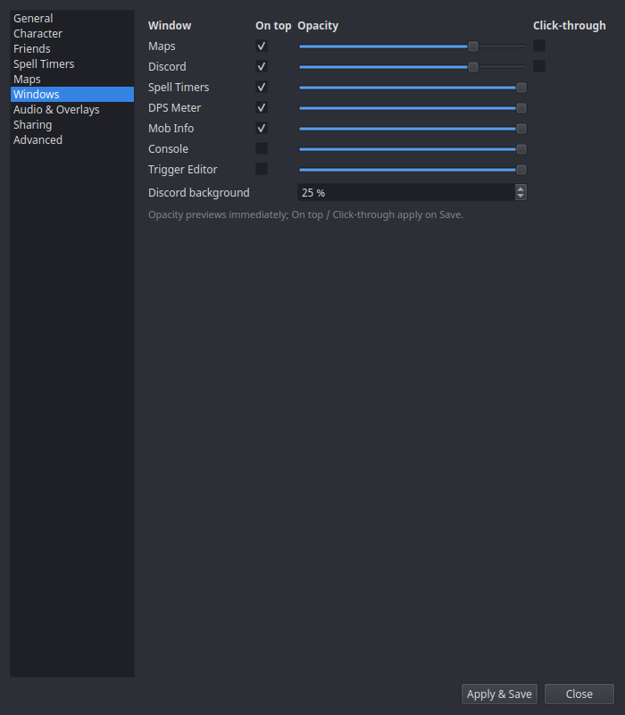

# Settings → Windows

A grid with one row per window — Maps, Discord, Spell Timers, DPS Meter,
Mob Info, Console, Trigger Editor — and three columns:

| Column | What it does |
|---|---|
| **On top** | Keep the window above the game (what makes an overlay an overlay). Applies on Save. |
| **Opacity** | Window transparency — previews live as you drag the slider. |
| **Click-through** | Clicks pass straight through to the game. Great for HUD-style overlays; remember you'll need to come back *here* to turn it off, since you can no longer click the window. Applies on Save. |

The Discord row has an extra **Discord background** opacity slider, which
controls the overlay's backdrop separately from the window itself.

Window *positions* aren't set here — drag the windows themselves, and use
tray → **Window Layouts** to save named position presets
([Windows & Overlays](../windows/index.md#window-layout-presets)).
