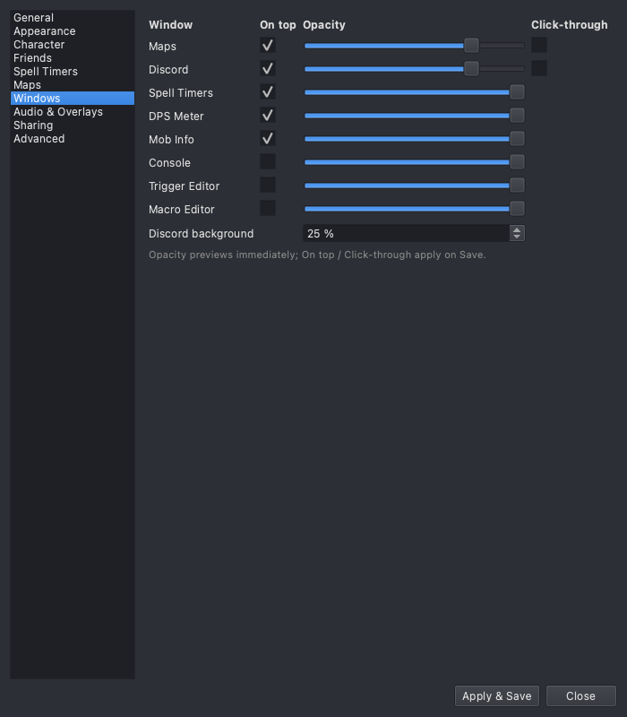

# Settings → Windows

A grid with one row per window — Maps, Discord, Spell Timers, DPS Meter,
Mob Info, Console, Trigger Editor, Macro Editor — and three columns:

| Column | What it does |
|---|---|
| **On top** | Keep the window above the game (what makes an overlay an overlay). Applies on Save. |
| **Opacity** | Window transparency — previews live as you drag the slider. |
| **Click-through** | Clicks pass straight through to the game. Great for HUD-style overlays; remember you'll need to come back *here* to turn it off, since you can no longer click the window. Applies on Save. |

The Discord row has an extra **Discord background** opacity slider, which
controls the overlay's backdrop separately from the window itself.

## Plugin windows

If you run [add-ons](../plugins/index.md), any window they open gets its own
row too, below a **Plugin windows** separator and labelled
`<add-on name> — <window title>`. They carry **On top** and **Opacity** and
work exactly like the built-in rows — nothing extra to install, and nothing
the add-on's author had to do.

They have no **Click-through** box, deliberately: a click-through window
can't be clicked, and unlike Maps and Discord an add-on window has no menu
bar to reach for once it stops responding.

Two things worth knowing:

- **Only add-ons that actually opened a window this session get a row.** One
  you disabled, one that errored on load, one you uninstalled — none of them
  appear. Their saved opacity isn't discarded, it just sits in your settings
  until the add-on comes back. Because nothing hot-loads, an add-on you
  enabled a moment ago only shows up here after the restart that starts it
  ([Settings → Plugins](plugins.md)).
- **An add-on can only offer a row for a window it built on the nParse+
  overlay base.** Most do, since that is what the SDK hands them. One that
  builds a plain Qt widget instead still opens from the tray, but nParse+ has
  no opacity or on-top state to give you for it.

Window *positions* aren't set here — drag the windows themselves, and use
tray → **Window Layouts** to save named position presets
([Windows & Overlays](../windows/index.md#window-layout-presets)).
