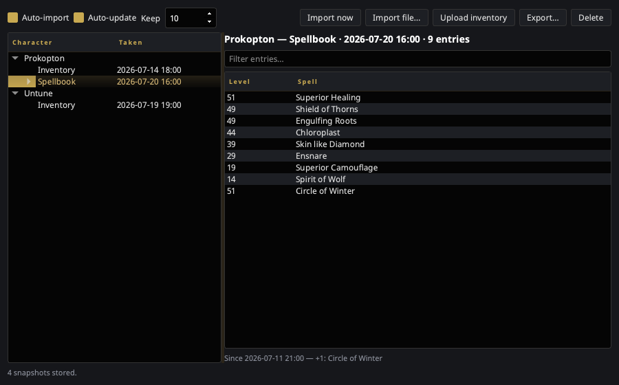

# Character Dumps

The EQ client can write two snapshots of a character to a text file:

```
/outputfile inventory
/outputfile spellbook
```

It drops them in your EverQuest folder as `<Character>-Inventory.txt` and
`<Character>-Spellbook.txt` — and **overwrites them every time**. The game
keeps exactly one copy of each and no history at all, so the dump you took
before that raid is gone the moment you take another.

The Character Dumps window is a library of those files. Every character keeps
its own current inventory *and* its own current spellbook, with the previous
few versions behind each one.



Open it from the tray → **Character Dumps**, or type `toggle_dumps` in game.
It needs the **EQ install directory** set in
[Settings → General](../settings/general.md) — that is the only place dumps
live.

## Layout

- **Left** — a tree of characters. Under each is an **Inventory** and a
  **Spellbook** branch, when that character has one. The branch row *is* the
  current snapshot and shows when it was taken; older snapshots hang beneath
  it, newest first.
- **Right** — the selected snapshot's contents, with a filter box. An
  inventory lists Location / Item / Count / ID; a spellbook lists Level /
  Spell in book page order. Underneath, a line saying what changed since the
  snapshot before it.
- **Bottom** — how many snapshots are held and what the last scan did.

Empty inventory slots are dropped on import. The client writes a row for
every slot whether or not anything is in it, and keeping them would swamp
every comparison.

## The toggles

| Control | What it does |
|---|---|
| **Auto-import** | Watch the EQ folder and pull in dumps for a character and type this library has never seen. Also the master switch — off means no scanning at all. |
| **Auto-update** | When a dump already in the library changes, store the new version as another snapshot. Off keeps the first import and ignores later `/outputfile` runs. |
| **Keep** | How many snapshots to hold per character, per type. Older ones are pruned as new ones land. |

Both toggles are on by default. Unlike the pigparse.org upload — which is off
until you opt in, because it sends your character to a website — this only
reads files the game already wrote and copies them into nParse+'s own data
folder.

Re-running `/outputfile` without having changed anything does **not** pile up
snapshots: an unchanged dump is recognised by content and dropped.

## Buttons

| Button | What it does |
|---|---|
| **Import now** | Rescan the EQ folder immediately. Works regardless of the toggles. |
| **Import file…** | Take in a dump from anywhere — a backup, another machine, a friend's. A file whose name doesn't say who it belongs to still works; nParse+ reads it and asks which character it is. |
| **Upload inventory** | Send inventory snapshots to the [destination you picked](#uploading-your-inventory). Works whether or not auto-import is on. |
| **Review import…** | Only while a p99planner handoff is waiting: re-opens the review page. Right-click it to cancel the handoff instead. |
| **Export…** | Write the selected snapshot back out in the client's own format, so other P99 tools can read it. |
| **Delete** | Remove the selected snapshot. With a character row selected, forget that character entirely. |

## Uploading your inventory

[Settings → Sharing](../settings/sharing.md) has one **Send inventory dumps
to** picker. It offers two destinations, and **Off**, which is the default:

| Destination | What it needs | What happens |
|---|---|---|
| **pigparse.org character page** | A Discord login (same page) | Your items are posted to your pigparse.org character page. |
| **p99planner.com** | Nothing at all | The export is staged and a review page opens in your browser. You see exactly what would change, and approve it. |

p99planner needs no account, no API key and no login. Instead of applying
anything, nParse+ hands the site your raw export and gets back a private
**claim link**; nothing reaches your planner characters until you approve it
on that page. The link lasts 24 hours, and later dumps in the same session
join the *same* link — so a five-mule bank run is one review page, not five.

!!! warning "The claim link is private"

    Anyone holding that link can read those exports and import them into
    their own planner. nParse+ opens it in your browser rather than printing
    it, and never writes it to the log or shows it on screen. Don't paste it
    into chat. If it does leak, the exposure is one item list for at most 24
    hours, and opening the link burns it.

### While a handoff is waiting

nParse+ opens the review page for you the first time it stages something,
and only then — later dumps in the same session join the link silently, so
approving is one page visit rather than one per mule.

Because the link is never displayed, the window is the way back to it. While
exports are waiting, the status line says so (with the expiry) and a
**Review import…** button appears next to Upload inventory:

- **Click it** to re-open the review page — after you closed the tab, for
  instance.
- **Right-click it** for *Open review page*, *Copy review link*, and *Cancel
  handoff…*.

**Copy review link** is the escape hatch for a machine where nParse+ can't
launch a browser at all (no default browser, a locked-down desktop). The
status line tells you to use it when that happens, and keeps telling you for
as long as it's true. Paste the link into any browser to approve the import
— but treat it like a password on the way there.

Cancelling releases the staged copy and the link stops working; anything you
already approved is unaffected. And if you simply never approve, the link
expires after 24 hours and p99planner sweeps it. Nothing reaches your planner
characters either way.

!!! note "Restarting nParse+ forgets a pending link"

    The claim is held for the session only. Restart before approving and the
    Review button is gone — the link itself is still valid (it's in your
    browser history, and live for its 24 hours), and your next upload simply
    stages a fresh one. The orphan expires on its own.

### The Upload inventory button

Uploading normally happens on its own as dumps arrive. The button is there
for when it shouldn't have to — auto-import off, a dump taken before you
started nParse+, or a mule roster you want to send in one go. What it sends
follows your selection, narrowest first:

| Selected | What is sent |
|---|---|
| An inventory snapshot | That snapshot. |
| A character (or their spellbook) | That character's current inventory. |
| Nothing | Every character's current inventory — the whole roster, in one call. |

The status line at the bottom reports what happened.

## Where the files live

Snapshots are plain JSON under nParse+'s data directory:

```
<data dir>/dumps/<Character>/<inventory|spellbook>/<when>-<digest>.json
```

`<data dir>` is `~/Library/Application Support/nparseplus` on macOS,
`%LOCALAPPDATA%\nparseplus` on Windows, and `~/.local/share/nparseplus` on
Linux. Deleting the folder loses the history and nothing else.

### What uploads by itself, and what doesn't

Automatic uploading is deliberately narrow — the library is local storage,
and only some of what lands in it is something you asked to publish:

| | Uploads automatically |
|---|---|
| A dump you take in game this session | Yes |
| **Import now** (rescans the EQ folder) | Yes — same files, same source |
| A dump already in the EQ folder at launch | No — collected, not published |
| **Import file…** (a file you browse to) | **No** |
| Anything, with **Auto-update** off | Yes — retention has no say in this |

**Import file…** never uploads on your behalf. That file may be a backup, an
export off another machine, or another player's dump, and none of those were
offered up for publishing by being picked in a file dialog. Use **Upload
inventory** when you do want one sent.

Likewise, **Auto-update** is purely about how much local history to keep. It
does not gate uploading in either direction — an earlier version of this let
one stale snapshot at startup silence uploads for the rest of the session.

## For plugin authors

The library publishes two bus events. They mean **"a snapshot was stored"** —
a fact about your local history, which is what an add-on watching the library
wants. They are not an "about to be uploaded" signal; uploading is decided
separately, by the rules above.

The two events let an add-on react to a dump
without polling anything:

| Event | When |
|---|---|
| `CharacterDumpImportedEvent` | The first snapshot for a character and type. |
| `CharacterDumpUpdatedEvent` | A tracked dump changed. Carries `added` / `removed` entry names. |

```python
from nparseplus_sdk import events

class MyPlugin:
    def activate(self, ctx):
        self.ctx = ctx
        ctx.subscribe(events.CharacterDumpUpdatedEvent, self.on_dump)

    def on_dump(self, event):
        if event.kind == "spellbook" and event.added:
            self.ctx.logger.info("%s learned %s", event.character, ", ".join(event.added))
```

Both events carry `character`, `kind`, `captured_at`, `entry_count`,
`digest`, and `path` — the stored snapshot, not the game's file. To read the
contents, open the library:

```python
from nparseplus.config.paths import dumps_dir
from nparseplus.core.dumps import DumpKind, DumpLibrary

book = DumpLibrary(dumps_dir()).load_latest("Prokopton", DumpKind.SPELLBOOK)
```

See [Developing plugins](../plugins/developing.md) for the rest of the
plugin contract.
