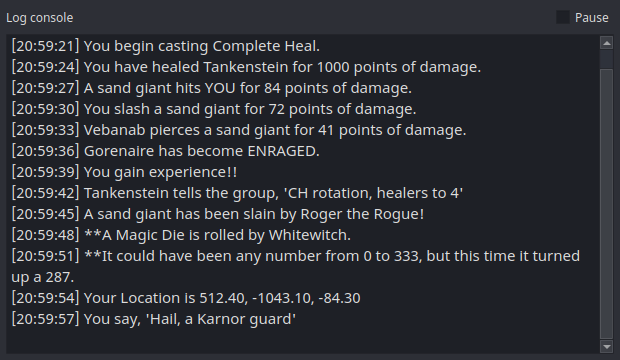

# Console

The Console is a plain scrollback of raw log lines with timestamps — the
easiest way to check that nParse+ is reading your log, and the best friend
of anyone [writing triggers](trigger-editor.md).

Open it from the tray → **Console**.

- **Pause** (checkbox, top right) freezes the scrollback so you can copy a
  line — e.g. to paste into the Trigger Editor's test box.
- The buffer keeps the most recent 2,000 lines.
- Unlike the overlays, the Console is a normal framed window by default
  (not always-on-top, not translucent) — it's a utility, not a HUD.

## Typical uses

- **First-run check**: say something in game; if it shows up here, the
  whole pipeline is live ([First run](../getting-started/first-run.md)).
- **Trigger authoring**: find the exact log line you want to match, copy
  it, and paste it into the
  [Trigger Editor's](trigger-editor.md) "Paste a log line…" test field.
- **Bug reports**: grab the lines around a misbehaving timer or parse.
