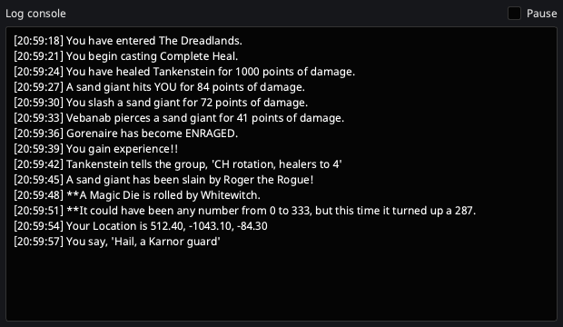

# Console

The Console is a plain scrollback of raw log lines with timestamps — the
easiest way to check that nParse+ is reading your log, and the best friend
of anyone [writing triggers](trigger-editor.md).

Open it from the tray → **Console**.

- **Right-click a line → Create trigger from this line…** opens the
  [Trigger Editor](trigger-editor.md) with a new trigger already filled in
  and already reporting `Matched.` against that line. See
  [Create a trigger from a log line](#create-a-trigger-from-a-log-line).
- **Pause** (checkbox, top right) freezes the scrollback so you can copy a
  line — e.g. to paste into the Trigger Editor's test box.
- The buffer keeps the most recent 2,000 lines.
- Unlike the overlays, the Console is a normal framed window by default
  (not always-on-top, not translucent) — it's a utility, not a HUD.

## Create a trigger from a log line

Right-click any row and pick **Create trigger from this line…**. The
[Trigger Editor](trigger-editor.md) opens with a new, enabled trigger in
your **Custom** group: the search text is built from the line, the display
text is prefilled, the test box below already holds the line, and the result
already reads `Matched.`. Nothing has been saved yet — edit what you want,
then **Apply**.

The search text is a *pattern*, not a paste. Two substitutions are offered
so the trigger fires again next time rather than only for the line you saw:

| The line | The suggested search text |
|---|---|
| `Gorenaire begins to cast a spell.` | `{name}\ begins\ to\ cast\ a\ spell\.` |
| `Gorenaire hits Soandso for 500 points of damage.` | `{name}\ hits\ {c}\ for\ 500\ points\ of\ damage\.` |

`{name}` is a capture you can use in the output text; `{c}` is your
character (see [Tokens](../features/triggers.md#tokens)). Everything else is
escaped, so punctuation, brackets and quotes match literally — the
backslashes are that escaping, and they are correct.

When a substitution was made, the menu offers a second entry —
**Create trigger from exact text…** — which makes a plain-text trigger
matching that one line word for word. Take it when the name in the line is
the whole point ("only tell me about *Gorenaire*").

Some lines get no substitution and only the first entry appears: your own
`You …` lines, and mobs written with a lowercase name after an article
(`A cliff golem hits YOU …`), where nParse+ can't tell where the name ends.
Add the token by hand if you want one.

The timestamp is never part of the trigger: nParse+ matches lines with the
timestamp already stripped, so a pattern containing one would never fire.

## Typical uses

- **First-run check**: say something in game; if it shows up here, the
  whole pipeline is live ([First run](../getting-started/first-run.md)).
- **Trigger authoring**: right-click the line you want to match and let the
  editor fill itself in — or find the exact line, copy it, and paste it into
  the [Trigger Editor's](trigger-editor.md) "Paste a log line…" test field.
- **Bug reports**: grab the lines around a misbehaving timer or parse.
