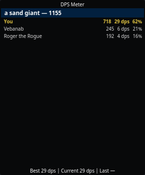

# DPS Meter

The DPS Meter is a frameless overlay showing live damage breakdowns: one
header per fight target with the group's total damage, one row per attacker
beneath it, and a session **Best / Current / Last** footer.

Open it from the tray → **DPS Meter**.

## Reading it

Each attacker row shows, left to right:

- **Name** (with level when known from the shared `/who` roster — see
  [Sharing](../features/sharing.md))
- **Total damage** dealt to that target this fight
- **Trailing DPS** — damage over the last 12 seconds, the same window
  EQTool uses, so numbers are comparable across tools
- **% of the group total**

Your own row is highlighted.

## How fights are tracked

- A fight starts when damage lands on a target and ends when the target
  dies or the fight goes quiet.
- The session footer tracks your best, current, and last fight DPS; a fight
  must last more than 20 seconds to count toward **Best**, so one lucky
  crit on a rat doesn't top your session.
- Your best DPS persists per character profile.

## Notes

- Only what the log reports can be counted: your hits, your pet's hits, and
  melee around you. Other players' spell damage isn't in your log, so
  raid-wide totals are approximate — same limitation as every log parser.
- Window position, opacity, always-on-top, and click-through persist in
  [Settings → Windows](../settings/windows.md).
