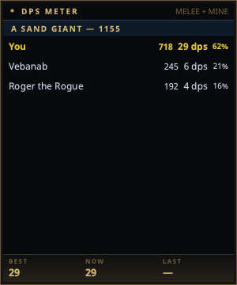

# DPS Meter

The DPS Meter is a frameless overlay showing live damage breakdowns: one
header per fight target with the group's total damage, one row per attacker
beneath it, and a session **Best / Current / Last** footer.



Open it from the tray → **DPS Meter**.

## Reading it

Each attacker row shows, left to right:

- **Name** (with level when known from the shared `/who` roster — see
  [Sharing](../features/sharing.md))
- **Total damage** dealt to that target this fight
- **Trailing DPS** — damage over the last 12 seconds, the same window
  EQTool uses, so numbers are comparable across tools
- **% of the group total**

Your own row is highlighted. So is your pet's, which is marked `(pet)` —
see below.

The title bar carries the counting mode (`MELEE`, `MELEE + MINE`, `ALL`) so
an empty caster row reads as a filter rather than a broken parser. Change it
in [Settings → DPS Meter](../settings/dps-meter.md).

## Casters: how spell damage is counted

EverQuest logs spell, proc and damage-over-time damage as

```
Gorenaire was hit by non-melee for 1250 points of damage.
```

That line names **no attacker at all** — not you, not the wizard next to
you. So a meter can either drop it (and show a caster nothing) or credit it
to you (and pad your row with the whole raid's nukes). nParse+ does neither
by default. It uses the one signal your own log gives: your casting.

Non-melee damage that lands while you are casting, or within the credit
window after, is counted as yours. Damage that arrives cold is not. With
**All damage** selected it is still added to the target's group so the
percentages stay honest, listed under `(spell damage)` rather than under
your name.

What this cannot do, said plainly:

- **Damage shields and weapon procs** follow no cast of yours, so they land
  in the unattributed bucket. A tank's proc damage is under-counted.
- **Two casters nuking the same target** inside one window are
  indistinguishable. This is a large improvement over "always you", not a
  proof.
- **Damage over time never appears, in any mode.** Project 1999 does not
  log DoT ticks at all — the per-tick message is a 2003 addition that was
  removed for not being classic — so no parser on P99 can show it.

## Pets

Your pet keeps its own row, marked `Vexer (pet)` and highlighted like
yours. Two rows rather than one is deliberate: whether the pet is holding up
(and whether it is still alive) is worth seeing on its own, and merging the
rows would make the per-row DPS and biggest hit meaningless.

The session **Best / Now / Last** footer counts you *and* your pet together,
which is your real output as a magician, necromancer, beastlord or charming
enchanter. Turn that off with **Count pet damage as mine** if you want the
footer to be your own hands only.

The pet is recognised by name, tracked through summon, reclaim, death and
charm break. Another player's pet is never counted as yours; a *charmed* pet
sharing a mob's name is not either.

When a pet dies part-way through a fight its row stops being marked as
yours — you no longer have a pet — but the damage it already did stays in
your footer for that fight. A pet you resummon mid-fight gets its own row,
and both count.

## How fights are tracked

- A fight starts when damage lands on a target and ends when the target
  dies or the fight goes quiet.
- The session footer tracks your best, current, and last fight DPS; a fight
  must last more than 20 seconds to count toward **Best**, so one lucky
  crit on a rat doesn't top your session.
- Your best DPS persists per character profile.

## Notes

- Only what the log reports can be counted: your hits, your pet's hits, and
  melee around you. Other players' spell damage isn't attributable from your
  log, so raid-wide totals are approximate — same limitation as every log
  parser.
- Counting rules live in [Settings → DPS Meter](../settings/dps-meter.md)
  and all apply without a restart.
- Window position, opacity, always-on-top, and click-through persist in
  [Settings → Windows](../settings/windows.md).
