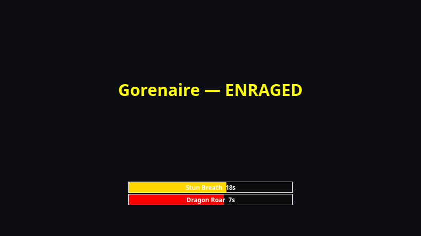

# Event Overlay

The Event Overlay is a full-screen, fully click-through transparent layer
that sits over the game and renders three kinds of content:

- **Alert text** — big centered outlined messages from
  [triggers](../features/triggers.md) (raid AOE warnings, failed feign,
  charm break, …), in the trigger's color, cleared automatically.
- **Timer bars** — countdown bars stacked bottom-center (AOE countdowns,
  trigger timers). Re-triggering a bar restarts it; bars vanish at zero.
- **CH chain lanes** — one lane per heal target with green chips sliding
  across it, one per CH call. See [CH chains](../features/ch-chains.md).

It never intercepts clicks, has no window chrome at all, and hides itself
when there's nothing to show — most of the time you forget it exists until
a dragon roars.

## Positioning it

Tray → **Position Event Overlay** shows the overlay's outline with a size
grip so you can drag and resize it to sit exactly over your game window.
**Double-click to lock it in place** when you're done. The geometry
persists.

!!! tip
    Make the overlay match your EQ window, not your whole monitor — alert
    text centers within the overlay region, so a full-monitor overlay on a
    windowed game puts alerts outside the game view.

## Tuning

In [Settings → Audio & Overlays](../settings/audio-overlays.md):

- **Alert-text duration** — how long alert text stays up (default 4 s)
  unless the trigger clears it earlier.
- **CH-lane retention** — how long an idle CH lane lingers after its last
  call (default 20 s), so healers keep a stable anchor per heal target.
