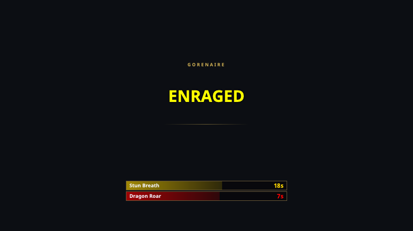
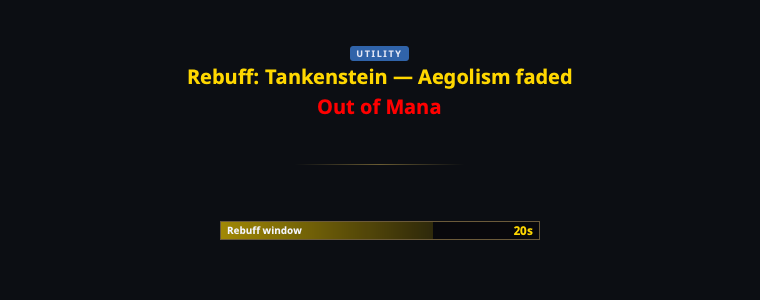

# Event Overlay

The Event Overlay is a full-screen, fully click-through transparent layer
that sits over the game and renders these kinds of content:

- **Alert text** — big centered outlined messages from
  [triggers](../features/triggers.md) (raid AOE warnings, failed feign,
  charm break, …), in the trigger's color, cleared automatically. The alert
  panel is centered within its configured region in every skin; other overlay
  windows keep their normal row and column alignment. See
  [How alert text is laid out](#how-alert-text-is-laid-out) for the two rules
  that decide how it is shown.
- **Timer bars** — countdown bars stacked bottom-center (AOE countdowns,
  trigger timers). Re-triggering a bar restarts it; bars vanish at zero.
- **CH chain lanes** — one lane per heal target with green chips sliding
  across it, one per CH call. See [CH chains](../features/ch-chains.md). When
  the **CH cadence indicator** is on, a muted marker on a lane's second-cell
  shows the cadence the raid leader called ([Settings → Audio & Overlays](../settings/audio-overlays.md)).
- **Utility** — a dedicated header section for utility alerts (rebuff
  requests, out-of-mana). The **Rebuff Request** and **Out of Mana** built-in
  [triggers](../features/triggers.md) (in the Utility folder, disabled by
  default) render here.



The **Utility** section groups rebuff/out-of-mana alerts under their own header
(a CH-lane cadence marker rides above it):



It never intercepts clicks, has no window chrome at all, and hides itself
when there's nothing to show — most of the time you forget it exists until
a dragon roars.

## How alert text is laid out

Two rules, and both are deterministic — nothing about your display text is
guessed at.

### The small gold label

An alert is shown as one headline **unless it begins with a short name
followed by a separator**, in which case that name becomes the small gold
label above it:

> `Gorenaire — ENRAGED` → **GORENAIRE** / *ENRAGED*
> `Death Touch: Soandso` → **DEATH TOUCH** / *Soandso*

Precisely: the **first** ` — `, ` -- `, ` - ` or `: ` in the text splits it,
and only if everything before that separator is

- at most 28 characters,
- at most 4 words, and
- free of `[ ] ( ) { } < > | / *`.

Anything that fails a single one of those is shown whole, at one size —
including the common raid-mob info dump, which used to lose its opening
clause to the gold label because it happened to contain ` - ` further along:

```
<Dozekar The Cursed> [Slowable, baneable] - [CH Unslowed: 2s, Slowed: 4s] // …
```

The split is presentation only. A trigger's **reset text** still matches
against the whole string, exactly as you typed it.

### Long text: shrink, then scroll

Alert text that does not fit its Alerts region is **shrunk** until it does,
down to a readable floor. Text still too long at that floor — a paragraph of
mob notes — then **scrolls** slowly upward through the region instead of
being cut off at the bottom.

The scroll is paced off the **alert text duration**
([Settings → Audio & Overlays](../settings/audio-overlays.md)): it pauses on
the first lines, walks the rest, and is timed to arrive before the alert
clears. It is also capped at a readable rate, so an alert long enough that
finishing would need a blur runs at the readable rate and shows as much as it
can — give it a longer duration, or a taller Alerts region, if you want the
rest.

## Positioning it

Tray → **Position Event Overlay** shows the overlay's outline with a size
grip so you can drag and resize it to sit exactly over your game window.
**Double-click to lock it in place** when you're done. The geometry
persists.

In position mode each region (CH chains, Alerts, Timer bars, and the Utility
section) is outlined with a dashed border and can be laid out on its own:

- **drag inside a region** to move it;
- **drag a region's edge or corner** to resize it (the cursor changes when
  you are over one).

A region's size sticks. For CH chains, Timer bars and Utility it is a
minimum — a sixth timer bar still grows the region rather than being cut off.
For **Alerts** it is exact, because that is the box the alert text is fitted
into: make it taller to get more of a long alert on screen at once, or
shorter to keep alerts compact. It stops shrinking once it is down to one
line of the smallest headline plus its gold label — below that there would be
nothing left to fit text into.

!!! tip
    Make the overlay match your EQ window, not your whole monitor — alert
    text centers within the overlay region, so a full-monitor overlay on a
    windowed game puts alerts outside the game view.

The alert's compact kicker follows the shared **UI / overlay font size**.
Its large headline uses the independent **Alert headline size** control; both
are on [Settings → Appearance](../settings/appearance.md).

## Tuning

In [Settings → Audio & Overlays](../settings/audio-overlays.md):

- **Alert-text duration** — how long alert text stays up (default 4 s)
  unless the trigger clears it earlier.
- **CH-lane retention** — how long an idle CH lane lingers after its last
  call (default 20 s), so healers keep a stable anchor per heal target.
