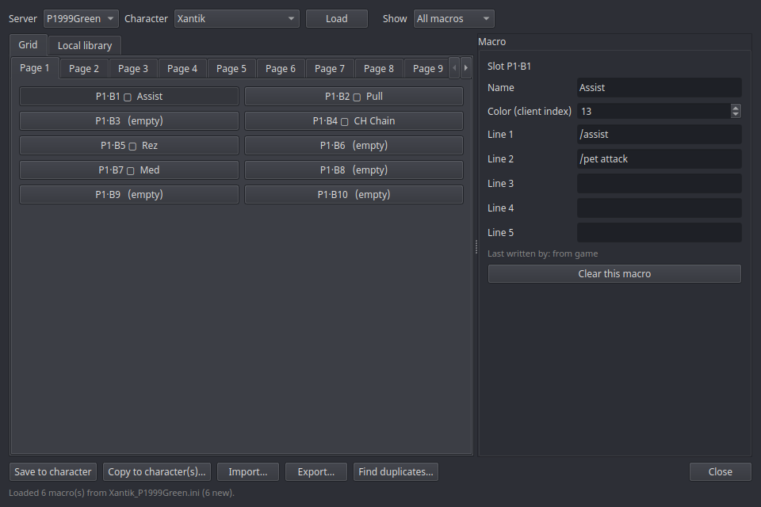

# Macro Editor

The Macro Editor is a framed tool window for browsing and editing a
character's in-game macros ("socials"), copying a macro set onto your other
characters, and sharing it as a file. See
[Macros & socials](../features/macros.md) for the concepts.

Open it from the tray → **Macro Editor**. It needs the **EQ install
directory** set in [Settings → General](../settings/general.md).

## Layout

- **Top bar** — pick the **Server** (P1999Green, P1999Blue, P1999Red,
  Real-Test) and **Character**, then **Load**. The **Show** filter dims
  slots that don't match an origin, rather than hiding them, so positions
  stay readable.
- **Left: Grid tab** — one tab per macro page, each a grid of button
  slots. A slot shows its position, an origin badge, a `⧉` marker when it
  duplicates another macro, and the macro's name. Empty slots say so.
- **Left: Local library tab** — the mirrored copy of this character's
  macros, grouped by origin. Macros the client has since dropped appear as
  *not in file*, with **Restore from local copy** beside the count.
- **Right: the macro form** — **Name**, **Color**, and up to five command
  lines, plus a line naming who last wrote this slot and **Clear this
  macro**. The command lines
  [autocomplete](../features/macros.md#autocomplete): type `/` for client
  commands, `%` for tokens like `%T`.

The page grid mirrors the in-game socials window, which also makes free
slots obvious — useful when an import offers to move a macro out of a
taken slot.

## Buttons

| Button | What it does |
|---|---|
| **Load** | Reads the selected character's macros and refreshes the local copy. |
| **Save to character** | Writes the working copy to that character's `.ini`. |
| **Copy to character(s)…** | Replicates this set onto other characters — **writes immediately**. |
| **Import…** | Merges a macro pack into the working copy. |
| **Export…** | Writes a macro pack, defaulting to only what you authored. |
| **Find duplicates…** | Lists duplicate groups and jumps to a slot. Changes nothing. |

## Editing rules

- Nothing reaches the `.ini` until **Save to character** — edits happen on
  a working copy. Closing with unsaved changes prompts you.
- **Copy to character(s)… is the exception**: it writes its targets
  straight away, like the friends push does. Its confirm dialog names the
  characters and says whether it will replace or merge.
- **Import never writes** — it only fills the working copy, and says so.
- Grid dimensions are read from your own file rather than assumed, so a
  client build with more pages, buttons, or lines works unchanged. An
  imported macro that would land outside your grid is reported instead of
  written.

## Safety

- Every file is copied into `socials_backup/` beside it before its first
  write, and that first copy is never overwritten.
- Saving warns — but does not stop you — when the EQ client looks to be
  running, because it rewrites these files on camp and logout. See the
  [warning in Macros & socials](../features/macros.md).
- Only the `[Socials]` section is rewritten. Other sections of the file,
  unrecognised keys, comments, and blank lines are preserved exactly.
- **Sync macros when EQ exits**
  ([Settings → Advanced](../settings/advanced.md)) keeps the local copy
  current without opening this window. It only reads your EQ directory —
  it never writes macros back into the game.

!!! note "Colour is a number"
    **Color** is the client's own palette index, shown as a raw number.
    The P99 palette mapping isn't verified, and a swatch showing the wrong
    colour would be worse than an honest index.
