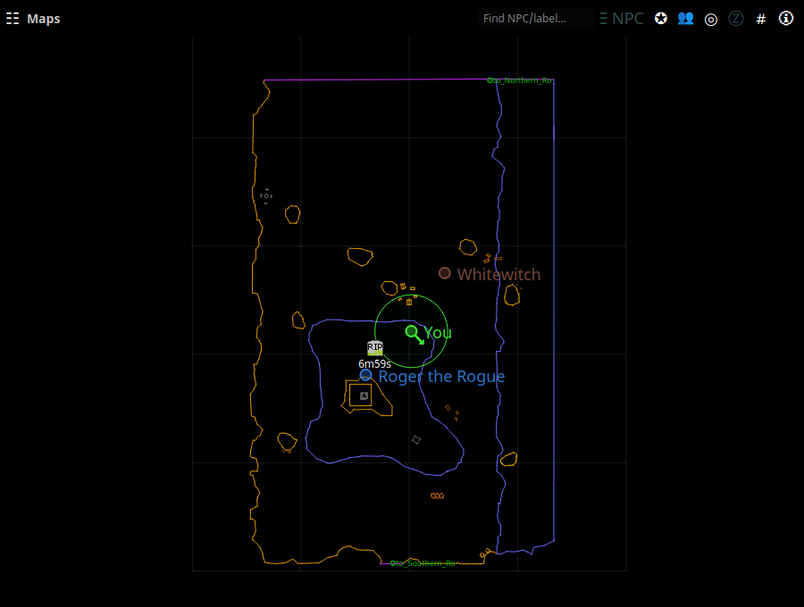

# Maps

The Maps window draws the community Brewall/P99 map for your current zone
with your live position on it — nParse's signature feature, extended with
EQTool's NPC database.

Open it from the tray → **Maps**. The map follows your log: zoning switches
maps automatically, and each `/loc` you type updates your marker (with a
direction arrow inferred from your movement).

## Your position and others'

- **You** are the marker with the direction arrow. Type `/loc` in game to
  update it (many players bind `/loc` to a movement key or use a hotbar
  macro).
- **Other players** appear as colored dots when
  [sharing](../features/sharing.md) is on — theirs and yours flow over the
  PigParse network (interoperating with EQTool users) or your own nparse
  websocket server. Names hover next to dots; a per-map toggle can hide
  others' dots ([Settings → Maps](../settings/maps.md)).
- **Tracking radius** — Druids, Rangers, and Bards get a circle showing
  their tracking range (set your Track skill in
  [Settings → Character](../settings/character.md)).

## NPC search and the notables list

- Type in the **Find NPC/label…** box to search map labels, the zone's
  notable NPC list, and — for anything not found locally — a live P99 wiki
  lookup. Click a result to flash its location on the map.
- **☰ NPCs** lists the current zone's notable NPCs with their respawn
  times.

## Spawn points, waypoints, and corpses

- **Right-click** the map to create a spawn point or waypoint at that spot.
  Spawn points start a respawn countdown you can see on the map; markers
  persist across zone changes and restarts.
- **Corpse waypoints** are dropped automatically when you die, so you can
  find your way back. On the nparse sharing wire, corpse locations can be
  shared with your group.
- Respawn countdowns also appear as rows in
  [Spell Timers](spell-timers.md); see
  [Respawn & zone timers](../features/respawn-timers.md).

## Display options

Zoom with the scroll wheel; drag to pan. In
[Settings → Maps](../settings/maps.md):

- line/grid width and **label size**
- **z-axis fading** — floors above/below you fade out smoothly, tuned per
  zone (enable, opacity floor, strength, fallback height)
- per-Z-layer opacity, other-players toggle

The map also supports **path recording** (record a route through a zone as
you run it) via the map's right-click menu, and **Load Map** to view any
zone's map without being there.
