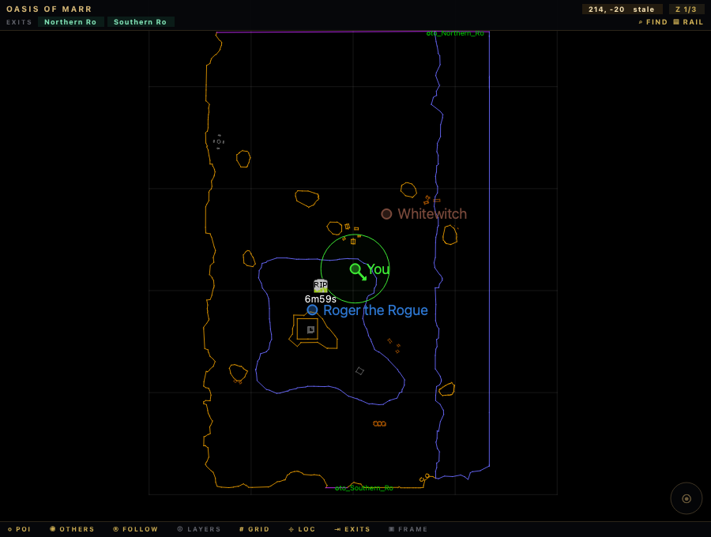

# Maps

The Maps window draws the community Brewall/P99 map for your current zone
with your live position on it — nParse's signature feature, extended with
EQTool's NPC database.

Open it from the tray → **Maps**. The map follows your log: zoning switches
maps automatically, and each `/loc` you type updates your marker (with a
direction arrow inferred from your movement).

## Your position and others'

- **You** are the marker with the direction arrow. Type `/loc` in game to
  update it (many players bind `/loc` to a movement key or use a hotbar
  macro).
- **Other players** appear as colored dots when
  [sharing](../features/sharing.md) is on — theirs and yours flow over the
  PigParse network (interoperating with EQTool users) or your own nparse
  websocket server. Names hover next to dots; a per-map toggle can hide
  others' dots ([Settings → Maps](../settings/maps.md)).
- **Tracking radius** — Druids, Rangers, and Bards get a circle showing
  their tracking range (set your Track skill in
  [Settings → Character](../settings/character.md)).

## Chrome that gets out of the way

The map spends its pixels on the map. Everything else is summoned:

- **Header and toolbar** fade in when the pointer is over the window and
  step back out when it leaves. The header names the zone, your last
  `/loc` with its age, the Z band you are on, and the zone's exits (click
  one to flash it). The toolbar carries the display toggles in words —
  POI, OTHERS, FOLLOW, LAYERS, GRID, LOC, FRAME — plus a **REC TRAIL**
  light while a path recording is running.
- **Edge tabs** name each exit on the border you would leave through,
  while the pointer is away. They stand down once the header is up, since
  it names the same doors in words.
- **The recenter puck** sits bottom-right: muted while you are centred on
  yourself, lit with a bearing arrow and distance once you have panned
  off. Click it to come back — no extra `/loc` needed.
- **The rail** (<kbd>Tab</kbd>) lists what the zone actually has: its
  respawn timer, its zone lines, your markers, who is sharing with you,
  and any trail being recorded. Sections with nothing in them are not
  shown rather than shown empty.

## NPC search and the notables list

- Press <kbd>Ctrl</kbd>+<kbd>F</kbd> (or **⌕ FIND** in the header) to open
  the find palette. It searches map labels, the zone's notable NPC list,
  and — for anything not found locally — a live P99 wiki lookup. Click a
  result to flash its location on the map. <kbd>Esc</kbd> closes it.
- An **empty** palette lists the current zone's notable NPCs with their
  respawn times.

## Spawn points, waypoints, and corpses

- **Right-click** the map to create a spawn point or waypoint at that spot.
  Spawn points start a respawn countdown you can see on the map; markers
  persist across zone changes and restarts.
- **Corpse waypoints** are dropped automatically when you die, so you can
  find your way back. On the nparse sharing wire, corpse locations can be
  shared with your group.
- Respawn countdowns also appear as rows in
  [Spell Timers](spell-timers.md); see
  [Respawn & zone timers](../features/respawn-timers.md).

## Display options

Zoom with the scroll wheel; drag to pan. Scroll near a map **edge** to
nudge the backdrop instead — see below. In
[Settings → Maps](../settings/maps.md):

- line/grid width and **label size**
- **backdrop opacity** and the idle fade (see below)
- **z-axis fading** — floors above/below you fade out smoothly, tuned per
  zone (enable, opacity floor, strength, fallback height)
- per-Z-layer opacity, other-players toggle

### Seeing through the map

Window opacity ([Settings → Windows](../settings/windows.md)) fades the
whole window — geometry, labels and dots with it — so turning the map
see-through with it also dims the lines you are trying to read. The
**backdrop** ([Settings → Maps](../settings/maps.md#transparency)) fades
only the fill behind the map; the ink always draws at full strength. Turn
window opacity back to 100 and use the backdrop instead.

The map also supports **path recording** (record a route through a zone as
you run it) via the map's right-click menu, and **Load Map** to view any
zone's map without being there.
