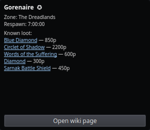

# Mob Info

The Mob Info overlay shows everything nParse+ knows about the last mob you
`/consider`ed: name, zone, respawn time, whether it's a notable (named)
spawn, a pet indicator, and — when connected to the
[PigParse network](../features/sharing.md) — its known loot with recent
auction prices.

Open it from the tray → **Mob Info**, then `/consider` (or just `/con`) any
mob in game.

## What you see

- **Name and zone**, with a notable flag when the mob is a named/rare spawn
  worth camping.
- **Respawn time** from the per-NPC database (ported from EQTool, covering
  121 zones) — the same data that drives
  [respawn timers](../features/respawn-timers.md).
- **Pet indicator** when the target is another player's pet (so you don't
  waste a camp check on it).
- **Known loot with prices** — the mob's drop list with PigParse's 6-month
  weighted-average WTS prices, when the network layer has the data. Each
  loot row links to its P99 wiki page.
- **Open wiki page** button for the mob itself.

## Notes

- Prices come from pigparse.org's auction scraping and require the
  [PigParse sharing mode](../features/sharing.md) to be active; without it
  you still get name/zone/respawn/notable from local data.
- Window position, opacity, and click-through persist in
  [Settings → Windows](../settings/windows.md).
