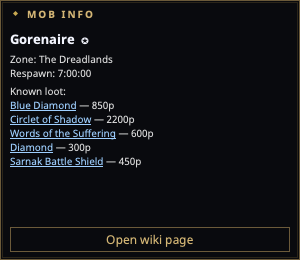

# Mob Info

The Mob Info overlay shows everything nParse+ knows about the last mob you
`/consider`ed: its name, its zone, its respawn time, whether it's a notable
(named) spawn, a pet indicator — and the mob's whole
[P99 wiki](https://wiki.project1999.com) page: the stat block, where it
spawns, what it drops, and the page's picture.

Open it from the tray → **Mob Info**, then `/consider` (or just `/con`) any
mob in game.

## What you see

- **Name and zone**, with a notable flag when the mob is a named/rare spawn
  worth camping.
- **Class, race and level**, under the name.
- **Stat block** — HP, AC, damage per hit, attacks per round, attack speed,
  run speed and aggro radius. Only the rows the wiki page actually states
  appear; P99 pages vary, and many trash mobs have no page at all.
- **Spawn location** — the page's whole `location` field, so a mob with three
  spawn points shows all three (the map still plots the first).
- **Respawn time** from the per-NPC database (ported from EQTool, covering
  121 zones) — the same data that drives
  [respawn timers](../features/respawn-timers.md) — and, on a separate line,
  what the wiki says. Both, because they answer different questions: the
  database always produces a number (falling back to the zone's default and
  then to a global 6:40), so it cannot tell you it has never heard of this
  NPC. A wiki saying "7 Days (+/- 8 Hours Variance)" next to a 6:40 default
  is telling you something.
- **Specials, factions, opposing factions and related quests**, each linking
  to its own wiki page.
- **The picture** from the mob's wiki page, when it has one.
- **Known loot** — the drop table, with PigParse's 6-month weighted-average
  WTS prices on the items it has seen traded, and the wiki's rarity
  (`Common`, `Rare`, `Ultra Rare`, `Always`) beside each. Each row links to
  its item page.
- **Pet indicator** when the target is another player's pet (so you don't
  waste a camp check on it). A pet is never looked up on the wiki.
- **Open wiki page** button for the mob itself.

## Where the loot list comes from

Two places, merged into one list:

- **PigParse** supplies prices, and needs
  [PigParse sharing mode](../features/sharing.md) to be on.
- **The wiki** supplies the drop table itself and each item's rarity, and
  needs nothing at all.

When both know an item it is one row: the price is PigParse's, the rarity is
the wiki's. Priced rows sort to the top, because the list is clipped and a
price is the thing you cannot get anywhere else in the app. With sharing off
you still get the full drop table — just without prices.

## Settings

**Settings → Audio & Overlays → Mob Info** carries two toggles, both on by
default and both applied without a restart:

- **Look up wiki details** — whether nParse+ contacts wiki.project1999.com at
  all. One request per mob you consider, cached for the session; the window's
  own refresh never fetches. Turning it off leaves the name, the zone and the
  respawn timer.
- **Show mob picture** — downloads the page image once at thumbnail size and
  keeps it in the local cache directory.

## Notes

- Window position, opacity, and click-through persist in
  [Settings → Windows](../settings/windows.md). The body scrolls, so the
  window can be as small as you like without losing the picture or the drops.
- Not every page carries every field. Respawn time and attack speed are the
  most commonly missing; a mob with no wiki page at all still shows name,
  zone, respawn and the notable flag from local data.
- If the detail line says **“Wiki: unavailable”**, nParse+ could not reach the
  wiki; it is different from a mob whose page simply has no details. Check
  your connection and `nparseplus.log` for the network error, then consider
  the mob again. A failed request is deliberately not cached, so recovery
  does not require restarting the app.
