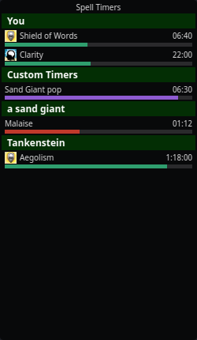

# Spell Timers

The Spell Timers overlay lists every active spell, buff, debuff, cooldown,
counter, and ad-hoc timer as a row with a name, remaining time, and a thin
progress bar — grouped by target, with your own buffs (**You**) always first.

Open it from the tray → **Spell Timers**.

## How rows get there

When you (or someone near you) casts a spell, nParse+ matches the cast
message against the real spell database and starts a countdown scaled to the
caster's level and class — which is why setting your class and level in
[Settings → Character](../settings/character.md) matters. Rows disappear
when the timer expires or when the log reports the effect worn off.

Bar colors carry meaning:

| Color | Meaning |
|---|---|
| Green | Beneficial effect (buff, song) |
| Red | Detrimental effect (debuff, DoT) on the target |
| Blue | Cooldown (e.g. Harm Touch, Lay on Hands, discipline reuse) |
| Purple | Ad-hoc timer (trigger timers, [chat-command timers](../features/chat-timers.md), respawn timers) |
| Amber | Random-roll tracking window |

Spell rows show their **gem icon** from the spell data.

## Useful behaviors

- **Self-buffs survive camping** — your own buffs are saved per character
  and restored (with the elapsed time subtracted) when you log back in.
- **Buff-fade warnings** — get a color change and optional spoken warning
  N seconds before a buff drops
  ([Settings → Spell Timers](../settings/spell-timers.md)).
- **Stacked detrimentals** — recasting a debuff before it fades either
  restarts the row or stacks a new one, following EQTool's per-spell
  behavior (roots always refresh). Configurable per character (Timer
  recast in [Settings → Character](../settings/character.md)).
- **Class filters** — hide spell rows that don't matter to your class
  ("Show spells for classes" in Settings → Character).
- **Show only your own spells** and **guess ambiguous spells** toggles live
  in [Settings → Spell Timers](../settings/spell-timers.md). Ambiguous
  casts (several spells share one cast message) show a best guess when
  enabled.
- **Raid mode** — with many casters around, rows can auto-group to stay
  readable (Auto raid-mode grouping in Settings → Spell Timers).

## Related

- [Respawn & zone timers](../features/respawn-timers.md) also render here
  (purple rows) when a mob dies.
- The legacy per-target spells window from original nParse is still
  reachable via the tray, but this overlay is its replacement.
