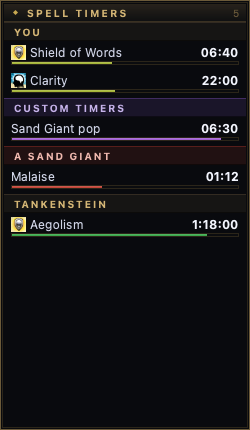
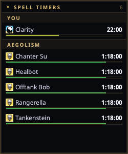
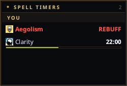

# Spell Timers

The Spell Timers overlay lists every active spell, buff, debuff, cooldown,
counter, and ad-hoc timer as a row with a name, remaining time, and a thin
progress bar — grouped by target, with your own buffs (**You**) always first.

Within each group, rows are ordered by **time remaining** (soonest-to-expire
first) by default; switch to **alphabetical** with the *Sort timers by*
dropdown in [Settings → Spell Timers](../settings/spell-timers.md). Counters
(which have no countdown) always sort last under time remaining.

Open it from the tray → **Spell Timers**.

## How rows get there

When you (or someone near you) casts a spell, nParse+ matches the cast
message against the real spell database and starts a countdown scaled to the
caster's level and class — which is why setting your class and level in
[Settings → Character](../settings/character.md) matters. Rows disappear
when the timer expires or when the log reports the effect worn off.

Bar colors carry meaning:

| Color | Meaning |
|---|---|
| Green | Beneficial effect (buff, song) |
| Red | Detrimental effect (debuff, DoT) on the target |
| Blue | Cooldown (e.g. Harm Touch, Lay on Hands, discipline reuse) |
| Purple | Ad-hoc timer (mob/roll timers, custom trigger and [chat-command timers](../features/chat-timers.md), respawn timers) |
| Amber | Random-roll tracking window |

Each bar also **shifts toward red as its timer runs down**, so a buff that is
about to drop stands out without reading the digits. Boat and roll timers keep
their color — their bars measure a schedule, not a countdown you started, so a
fade would be misleading. Turn the fade off with **Fade timer bars to red** in
[Settings → Spell Timers](../settings/spell-timers.md).

Spell rows show their **gem icon** from the spell data.

## Useful behaviors

- **Your timers survive camping** — see [Camping and logging back
  in](#camping-and-logging-back-in) below.
- **Buff-fade warnings** — get a color change and optional spoken warning
  N seconds before a buff drops
  ([Settings → Spell Timers](../settings/spell-timers.md)).
- **Stacked detrimentals** — recasting a debuff before it fades either
  restarts the row or stacks a new one, following EQTool's per-spell
  behavior (roots always refresh). Configurable per character (Timer
  recast in [Settings → Character](../settings/character.md)).
- **Class filters** — hide spell rows that don't matter to your class
  ("Show spells for classes" in Settings → Character).
- **Show only your own spells** and **guess ambiguous spells** toggles live
  in [Settings → Spell Timers](../settings/spell-timers.md). Ambiguous
  casts (several spells share one cast message) show a best guess when
  enabled.
- **Hide whole sections** — don't care about Boats, Mob Timers, Roll Timers,
  or Custom Timers? Each built-in section (and random rolls) has its own show/
  hide toggle in [Settings → Spell Timers](../settings/spell-timers.md).
  Hiding is display-only; the timers keep running underneath.
- **Right-click to clear timers** — right-click a row for *Clear '(name)'*,
  a section header for *Clear group*, or anywhere for *Clear other players'
  timers* (drops everyone else's spell rows but keeps your own buffs and mob
  timers) or *Clear all timers*. (With click-through enabled the overlay
  ignores all clicks, including right-clicks — toggle click-through off first.)
- **Flash on expiry (rebuff prompt)** — flag a spell via its right-click
  *Flash on expiry* action and, once it expires, its row stays on screen
  flashing as a rebuff/recast prompt instead of disappearing. Left-click the
  flashing row to dismiss it. The context action adds the spell to the
  per-spell allowlist and turns on the global toggle; tune the flash time (and
  turn the feature off) in [Settings → Spell Timers](../settings/spell-timers.md).
  Click-to-dismiss needs click-through off (click-through means the OS delivers
  no clicks).
- **Raid mode grouping** — with **Group buffs by spell (raid mode)** enabled
  in [Settings → Spell Timers](../settings/spell-timers.md), the buffs you cast
  on other players flip to spell-headed groups whenever they cover more
  distinct targets than distinct spells — one header per spell, one row per
  target — so a raid-wide buff reads as a single spell over many people. Your
  own buffs, NPC targets, the built-in sections, and detrimental/cooldown rows
  keep target headers. Orientation is recomputed every render, so it never gets
  stuck.
- **You choose the size** — drag the bottom-right corner grip to resize;
  the window keeps that size (persisted across restarts) and scrolls when
  there are more rows than fit, instead of growing down your screen and
  staying huge after the timers clear.

Raid mode turns a raid-wide buff into one spell header with a row per target:

A buff flagged *Flash on expiry* stays on screen flashing **REBUFF** until you
left-click to dismiss it:

## Camping and logging back in

When a camp completes, the rows that belong to *you* come off the window and
are saved to that character's profile. Camping with 20 minutes of Clarity no
longer means coming back to nothing, and a character who is not logged in no
longer leaves timers on your screen.

| | While camped | When you log back in |
|---|---|---|
| **Your buffs** | frozen and hidden | back with the **same** time remaining |
| **Your cooldowns** (Lay on Hands, Harm Touch, mend, disciplines, spell recast, memorize) and bard counters | hidden, still counting | back with the real elapsed time deducted — or gone, if they came up while you were away |
| **Boats, roll windows, custom/shared timers, mob respawns** | untouched, still visible and counting | unchanged |

Buffs freeze and cooldowns don't because that is what the game does: a reuse
timer runs in the real world whether or not you are logged in, and a buff on a
character sitting at the character-select screen does not tick.

Everything is saved **per character**, so camping one character and logging in
another brings back *that* character's timers and leaves the first one's saved
where they are. Abandoning a camp (`You abandon your preparations to camp.`)
before it completes changes nothing at all.

Two things worth knowing:

- **Log out with `/camp` or `/quit`, not by pulling the plug.** Both write the
  camp countdown to the log, which is nParse+'s cue to save. A **link death**
  writes nothing, so nParse+ can only fall back on the last thing your log
  said: your timers are saved as of the last line the game wrote, which is
  usually within a second or two of when you dropped, but can be minutes stale
  if you went link dead while idle in a silent zone.
- The save happens **when the camp completes**, so buffs that would have
  expired during the countdown are already gone from it.

## Related

- [Respawn & zone timers](../features/respawn-timers.md) also render here
  (purple rows) when a mob dies.
- The legacy per-target spells window from original nParse is still
  reachable via the tray, but this overlay is its replacement.
