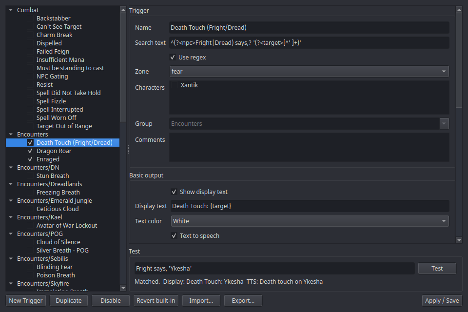

# Trigger Editor

The Trigger Editor is a framed tool window for browsing, editing, and
testing every trigger — the ~65 [built-ins](../features/builtin-triggers.md)
and your own custom ones.

Open it from the tray → **Trigger Editor**.

## Layout

- **Left: folder tree** — built-in folders (raid AOEs, utility, …) plus
  your own categories. Checkboxes enable/disable individual triggers or
  whole folders.
- **Right: the editor form** — everything about the selected trigger:
  - **Search text** — the text to match, as plain text or a **regex**
    (checkbox). [Tokens](../features/triggers.md#tokens) like `{name}` and
    `{c}` capture parts of the line.
  - **Zone gating** — restrict the trigger to specific zones.
  - **Characters** — check the character profiles this trigger applies to;
    leave all unchecked to keep it global. Only fires while a checked
    character is logged in (see
    [character scope](../features/triggers.md#character-scope)).
  - **Text output** — the alert text shown on the
    [Event Overlay](event-overlay.md), its color, and whether it's spoken
    via [TTS](../features/tts.md).
  - **Timer output** — an optional CountDown/CountUp timer bar: duration,
    bar color, restart behavior (start new / restart / do nothing), and
    separate "timer ending" / "timer ended" alerts.
  - **Counter** — count occurrences and expose `{COUNTER}` in the output.
- **Bottom: the test box** — *"Paste a log line…"* runs a real log line
  through the trigger's actual matching machinery and shows whether (and
  what) it would fire. Copy lines out of the [Console](console.md).

## Editing rules

- Nothing takes effect until **Apply** — edits happen on a copy.
- **Built-ins can be edited** (they're marked customized) but never
  deleted: for a built-in, Delete becomes **Disable**, and **Revert**
  restores the stock definition.
- Custom triggers can be created, moved between folders, and deleted
  freely.

## Import & export

**Export…** saves the current tree selection (a trigger, a folder, or —
with nothing selected — everything you'd want to share) to a JSON file;
**Import…** reads those files *and* GINA `.gtp` packages. Details in
[Sharing triggers](../features/triggers.md#sharing-triggers-export-import).

For the full trigger model — tokens, timers, counters, examples — see the
[Triggers feature guide](../features/triggers.md).
